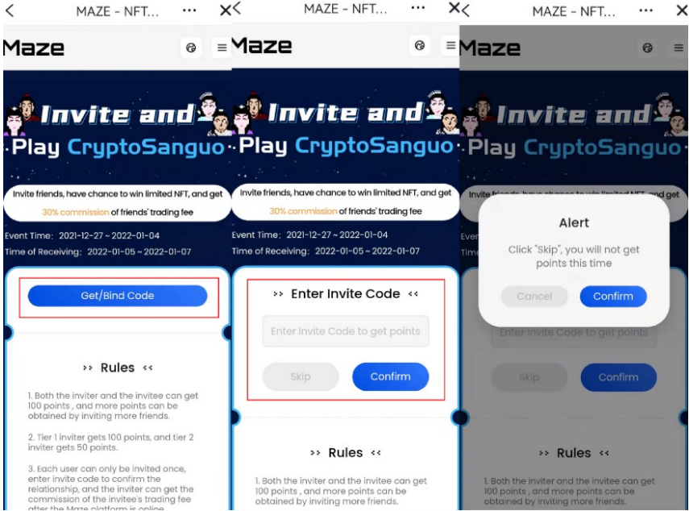

## A tutorial about how to register Maze platform and invite others

### Ⅰ. Tutorial for Mobile

1.1 During the event, users upgrate Bycoin to version V2.8.2 and click [Maze], and enter the event page.

Download Bycoin: <https://blockmeta.com/wallet/en/>

1.2 Users who enter the page for the first time need to click [Get/Bind Invite Code]. Enter invite code, confirm signature, then bind, you will receive 100 points. Click “Skip” will not get points this time.
Tips: Each address has only one chance to bind friend’s invite code. After you click [Confirm] or [Skip], and confirm signature, you will not able to change or bind again.

> If you don’t have any invite Code, here is Maze platform’s initial invite Code: MYTYYYYR

1.3 After entering/skipping invite code, the page will display your own invite code, you can share with your friends. When your friend’s account is successfully bound, both you and your friends will get 100 points. And you will also get 50 points when the invited friend successfully invites others.

1.4 The number of Tier 1 and Tier 2 invitaitons will be displayed at the bottom of page for users to check.

1.5 Users can access event page through the link in the information shared by others

### Ⅱ. Tutorial for web

Maze platform website: https://maz.network

2.1 Users (Web) need to install Byone (browser plug-in), click [Maze] to event page in Bytom network

2.2 Users who enter the page for the first time need to click [Get/Bind Invite Code]. Enter invite code, confirm signature, then bind, you will receive 100 points. Click “Skip” will not get points this time.

Tips: Each address has only one chance to bind friend’s invite code. After you click [Confirm] or [Skip], and confirm signature, you will not able to change or bind again.

> If you don’t have any invite Code, here is Maze platform’s initial invite Code: MYTYYYYR

2.3 After entering/skipping invite code, the page will display your own invite code, you can share with your friends. When your friend’s account is successfully bound, both you and your friends will get 100 points. And you will also get 50 points when the invited friend successfully invites others.

2.4 he number of Tier 1 and Tier 2 invitaitons will be displayed at the bottom of page for users to check.

2.5 Users can access event page through the link in the information shared by others

