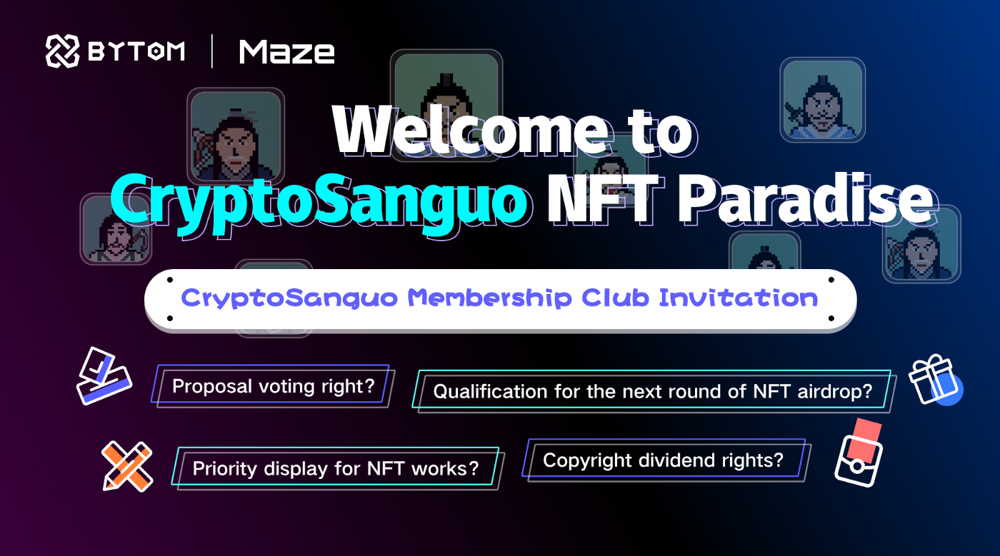
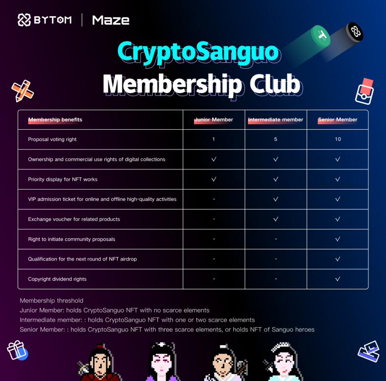

## Welcome to CryptoSanguo NFT Paradise

Compared with FT (Fungible Token), NFT, as an important type of digital assets in web3, has more artistic and cultural attributes. What’s more, NFT can also be a carrier of community consensus, which means that the members of community can truly have the ownership of a part of the community. And this is also the innovation of web3. It uses technology to enable buyers to confirm ownership directly on the chain, which cannot be tampered with by anyone. In web2, the relationship between brands and users is one-way. Many brands use various marketing methods to unilaterally export their brand culture to target users. However, in web3, brands and community members will own a mutually fulfilling relationship.

This time, Bytom has not only launched CryptoSanguo NFT, and simultaneously launched a new platform for supporting transactions, we also plan to build a new community based on the CryptoSanguo NFT, allowing NFT to empower the community and create CryptoSanguo IP. What is different from the past is that the focus of community operations will shift to discord servers, which makes community operations more clearer in the form of partitions. At the same time, we will also open up the problem feedback channel for community members in discord and launch a more complete feedback and governance mechanism, which means that we will delegate more power to the community in order to build the “in-DAO” brand.

Community members holding CryptoSanguo NFTs will have the right to initiate proposals and participate in voting to determine the future development and direction of the brand. The more they hold, the greater the voting power. In addition, community members also have the right to make a secondary CryptoSanguo IP creation, improving its ecosystem together, so that community members can truly own the brand itself.

CryptoSanguo NFT holders will also enjoy multiple community benefits, such as qualifications for participating in various online and offline high-quality activities, exchange vouchers around the brand’s related products, and admission tickets for large-scale online and offline art exhibitions. Not only that, but holders of CryptoSanguo NFT also have the priority to receive the next round of NFT airdrops. In addition, active contributors to the community will have the opportunity to become the brand ambassadors of CryptoSanguo to participate in the construction and management of discord channels and receive rare NFT airdrops.

In the future, CryptoSanguo IP may cooperate with the Gamefi team. The higher the scarcity of the NFT held, the more rights and interests can be exchanged in the game. And Maze platform will invite artists to settle in and organize online digital art exhibitions. NFT holders will have the opportunity to obtain admission tickets.

We are not only an NFT issuer, but also an initiator of the web3 brand paradise. We firmly believe that “The brand is the community, and the community is the brand”. Therefore, we sincerely invite you to join in to have fun and create an CryptoSanguo NFT paradise together.

