## Tutorial of claiming CryptoSanguo NFT

### Mobile

1. Enter claim NFT page

Click [Maze] icon within Bycoin
[https://blockmeta.com/wallet/en](https://blockmeta.com/wallet/en)   to enter Maze platform. Click [Invite and win NFT] to enter event page.

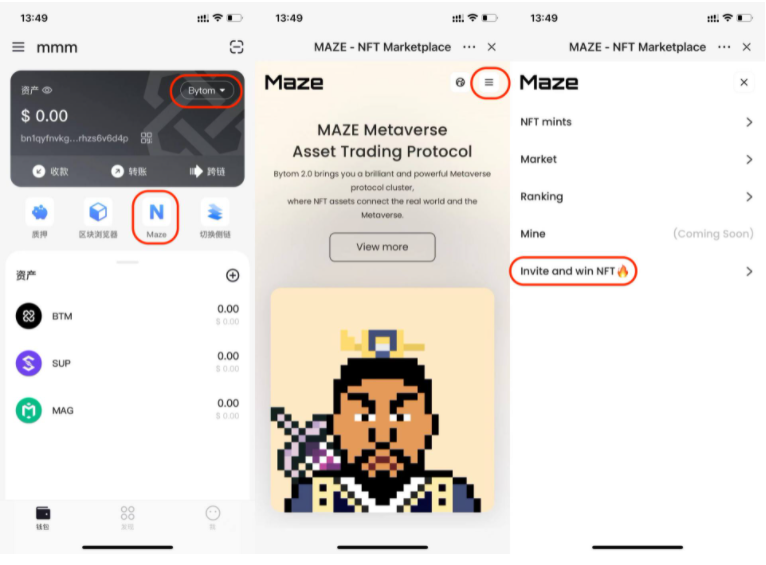

2. Verify eligibility

Click [Claim airdrop], verify signature and wallet password, and the system will automatically indicate whether the wallet is eligible to claim NFT.

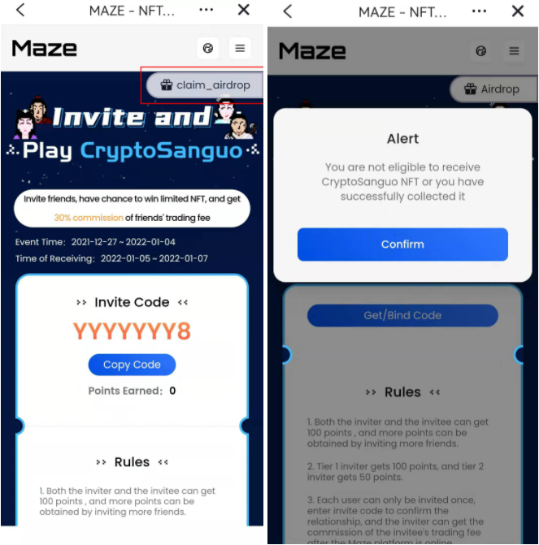

3. Claim NFT

If you are eligible to claim NFT, click [Claim] to enter the claiming status, the system will randomly match a CryptoSanguo NFT for the user to claim. The page will display the name of the NFT, the reference price (no reference price for the first claim) and the remaining time to claim the NFT, users must claim the NFT within the specified time, late is considered as abandonment.

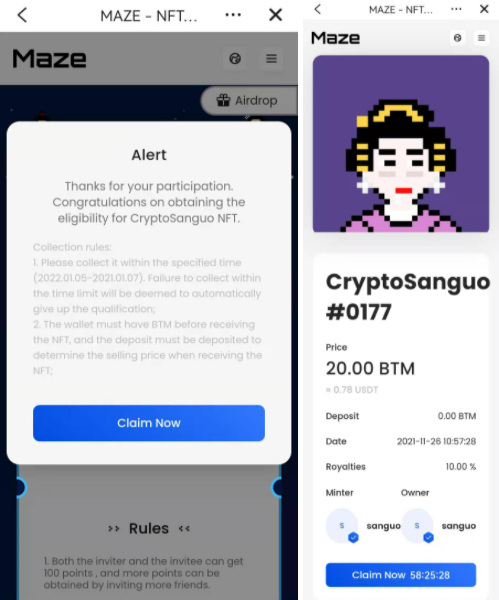

4. Set sell price

According to the radical trading mode, when users claim NFTs, they needs to have BTM in the Bycoin wallet, which is used to deposit margin to set the sell price of NFT (sell price = margin x10). The user enters the amount of margin they wish to deposit on the page and then click [Confirm], then verify the signature and successfully claim the NFT to their wallet address.

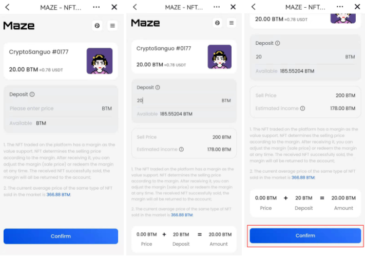

5. Complete claim

After successful claim, users can view the NFTs in [owns] of [Mine] page.

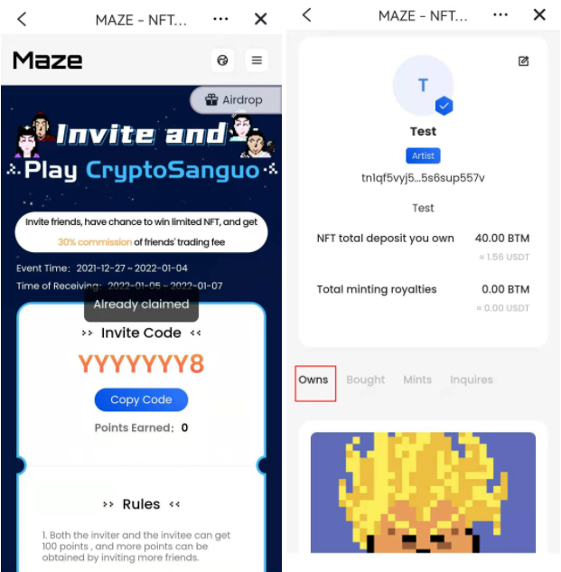

### WEB

1. Enter claim NFT page

Enter Maze platform：[https://maz.network/invite](https://maz.network/invite)  to the NFT claim page, and connect Byone wallet.

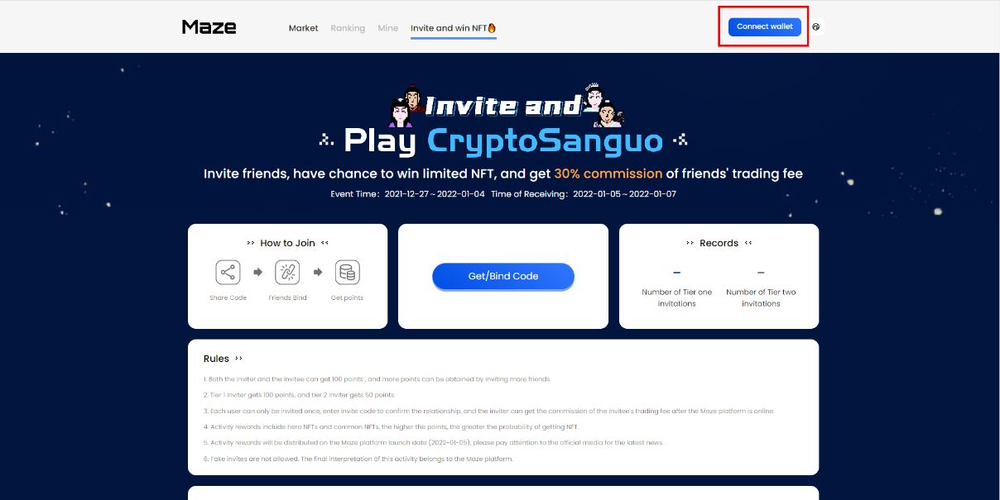

2. Verify eligibility

Click [Claim airdrop], verify signature and wallet password, and the system will automatically indicate whether the wallet is eligible to claim NFT.

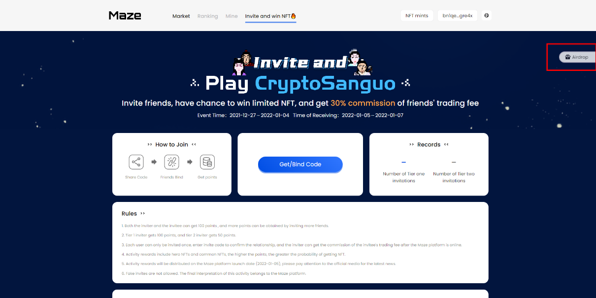
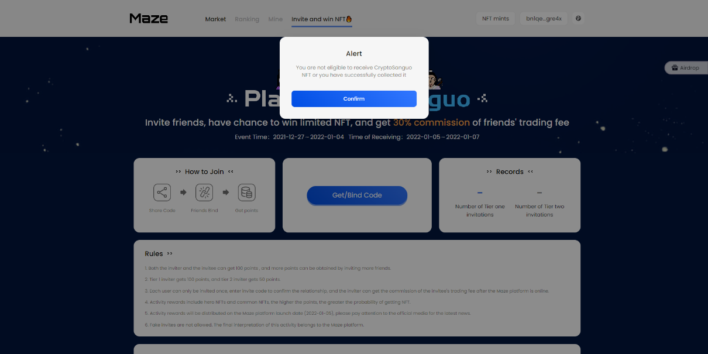

3. Claim NFT

If you are eligible to claim NFT, click [Claim] to enter the claiming status, the system will randomly match a CryptoSanguo NFT for the user to claim. The page will display the name of the NFT, the reference price (no reference price for the first claim) and the remaining time to claim the NFT, users must claim the NFT within the specified time, late is considered as abandonment.

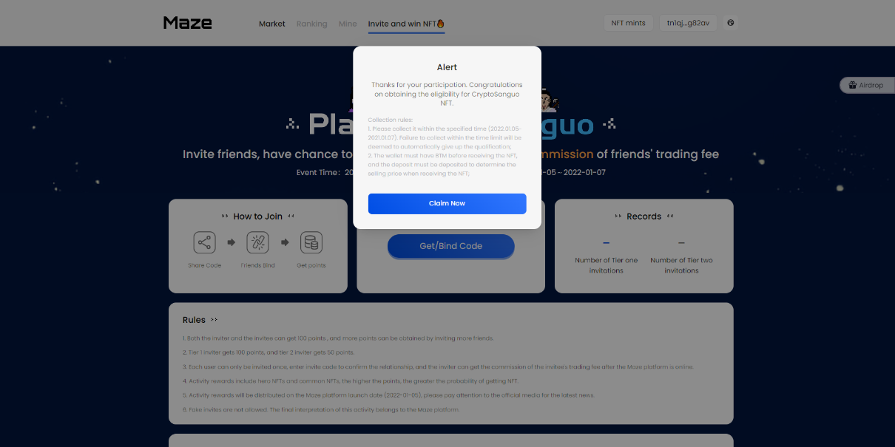
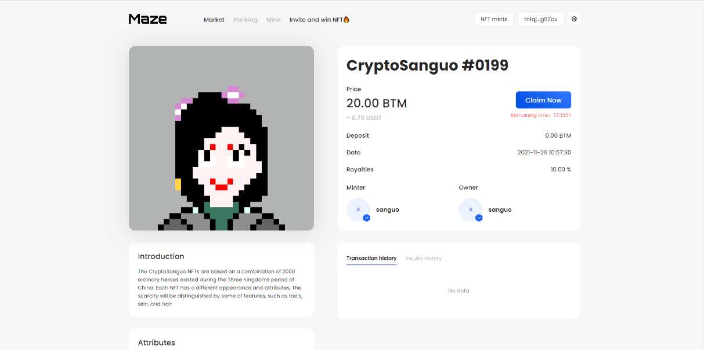

4. Set sell price

According to the radical trading mode, when users claim NFTs, they needs to have BTM in the Bycoin wallet, which is used to deposit margin to set the sell price of NFT (sell price = margin x10). The user enters the amount of margin they wish to deposit on the page and then click [Confirm], then verify the signature and successfully claim the NFT to their wallet address.

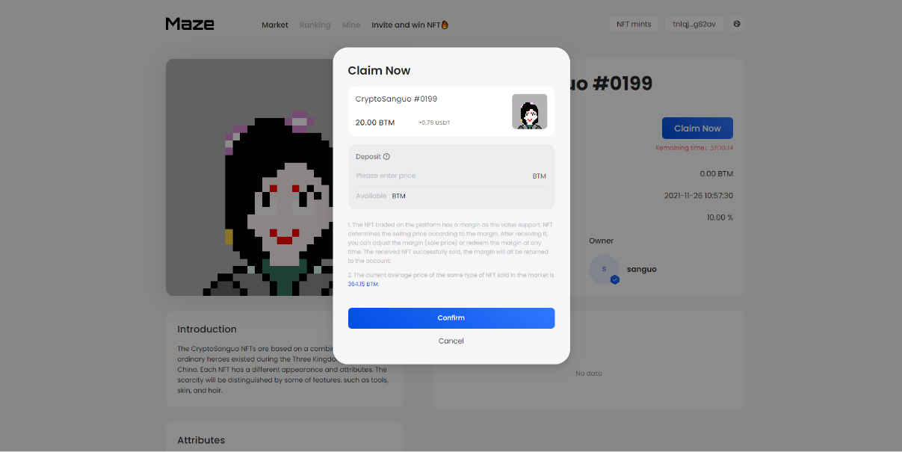
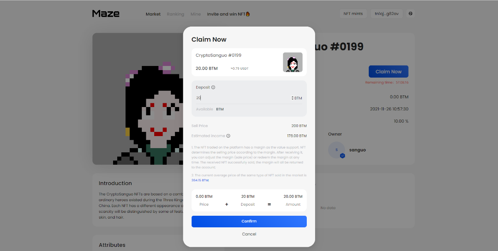
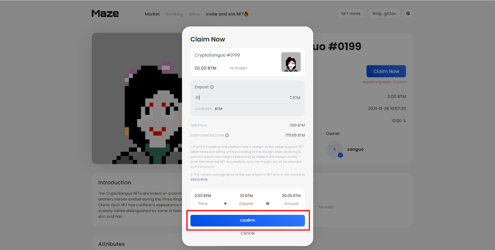

5. Complete claim

After successful claim, users can view the NFTs in [owns] of [Mine] page.

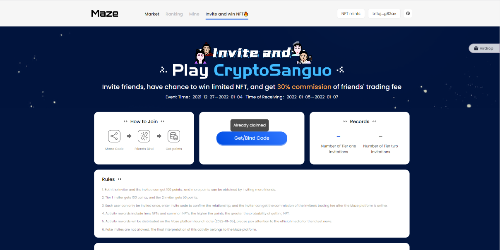
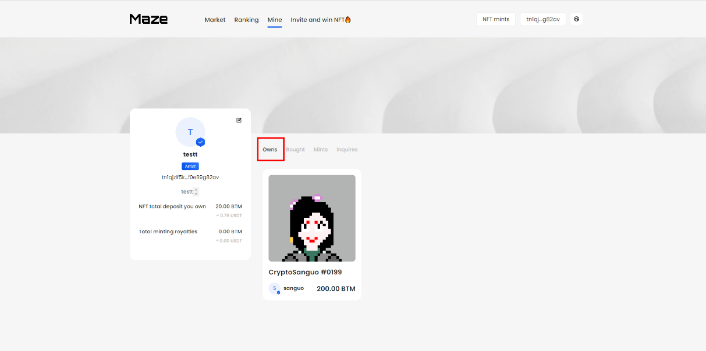