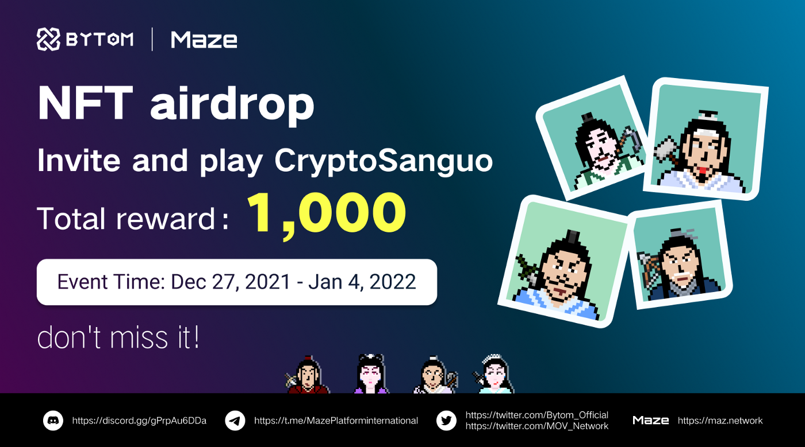

## 1000 limited CryptoSanguo NFTs Airdrop is coming!!!

### What is the CryptoSanguo NFT？

The CryptoSanguo NFT is a collection of 2,100 NFTs created based on historical heroes of the Three Kingdoms period in China, including 100 rare hero NFTs and 2,000 common NFTs. They are Bytom-based NFTs with reproduction function. You can trade or collect your CryptoSanguo NFTs on the Maze platform. These NFTs have a membership card function, and members can have exclusive benefits.

### Benefits for the CryptoSanguo NFTs holders

When you have the CryptoSanguo NFTs, you are already a member of the CryptoSanguo membership club, and these NFTs can be used as your digital identity to open the door to the metaverse.

1. Join the CryptoSanguo membership club and get exclusive benefits

   30% of the fees generated by trading the CryptoSanguo NFTs on the Maze platform will be returned to the previous contributors who invite others to sign up for the platform as a commission.

   The CryptoSanguo NFTs have the function of reproduction, and additional holdings can gain more income

   Early access to project planning or event information, which is beneficial for you to grow together with the community

   Opportunity to get free tickets of official offline events

2. Grant consumers ownership and commercial use rights of the NFTs

3. The NFTs received for free can be traded on the Maze platform

4. The CryptoSanguo NFTs have the opportunity to become medals or props in the metaverse game for more revenue

### How to get the CryptoSanguo NFTs?

- Invite friends to register and bind your invite code on the Maze platform to get points
- The top 1000 in the points ranking will get 1 common NFT
- The first 5 users who finish inviting more than 200 people to register will get 1 extra rare NFT

**Event Time:** Dec 27, 2021 — Jan 4, 2022

**Rewards:** 1005 CryptoSanguo NFTs (1000 common NFTs, 5 rare hero NFTs)

**Rules:**

**1-Follow @Bytom_Official & @MOV_Network**, like&RT (We will select 1 users to give common NFTs)

**2-Join Maze platform telegram community.**

Staff will be in the group to answer your questions and provide guidance.

> Maze platform Chinese community：<https://t.me/MazePlatformChinese>
>
> Maze platform international community: <https://t.me/MazePlatforminternational>

**3-Bind to get points**

> **Mobile:**
>
> Download Bycoin wallet (<https://blockmeta.com/wallet/en/>) and complete the registration (regular users please upgrade to lastest version), open the NFT page and enter invite code to get 100 points.
>
> **PC:**
>
> Use Google Chrome to open the Maze platform website([https://maz.network](https://maz.network/)), click the [Connect Wallet] button on the top right to download the Byone Wallet plugin, complete the registration and binding, fill in the invite code on the invitation page to get 100 points.

**4-Invite friends to get points**

The invitation page will generate your own invite code, which you can send to your friends. You will get 100 points when your friend finishes binding. And you will also get 50 points when the invited friend successfully invites others.

**About receiving rewards:**

**Duration:** Jan 5–7, 2022

Log in the Maze platform to receive your CryptoSanguo NFT. Please receive your reward within the specified time, otherwise you will be disqualified from receiving. (Tutorial for receiving rewards will be released on Jan.4)

**Tips:** Due to the radical trading model adopted by the Maze Protocol platform, your NFTs will start trading on chain as soon as you receive. Please pre-deposit BTM as margin, the amount of margin is 10% of the selling price. The received NFT successfully sold, the margin will all be returned to the account.

### How to get BTM?

1. By activity: Click Discover Page on Bycoin(<https://blockmeta.com/wallet/en/>) -> Click banner and join event.

2. Buy: You can buy BTM through the cryptocurrency exchange(OKex、Gate、MEXC、Huobi, etc.)

### Instructions

1. Fake invites are not allowed.

2. The final interpretation of this activity belongs to the Maze platform.

3. Contact: TG:18757583466

Long-term recruitment of digital collection creators, contact: TG:@an1dy2

> **Follow and join us**
>
> Twitter: @Bytom_Official & @MOV_Network
>
> Telegram: <https://t.me/MazePlatforminternational>
>
> Discord: <https://discord.gg/vbr9uuya3n>