## Tutorials of BMC SuperTX (Bycoin)

### 1.Upate to the Latest Bycoin

Download and update to the 2.9.0:  [https://blockmeta.com/wallet](https://blockmeta.com/wallet)

### 2. Creat a BMC Wallet

After updating, enter the main interface and click on the upper right corner to switch the network

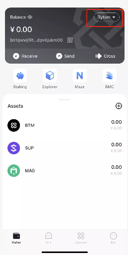

choose BMC network

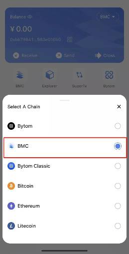

Enter the BMC network and create a BMC wallet

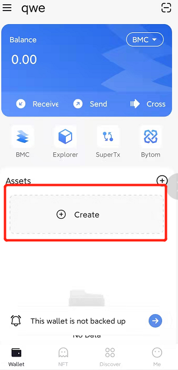

Enter the wallet password, the creation is successful

### 3. Enter the SuperTx

Press “SuperTx” 

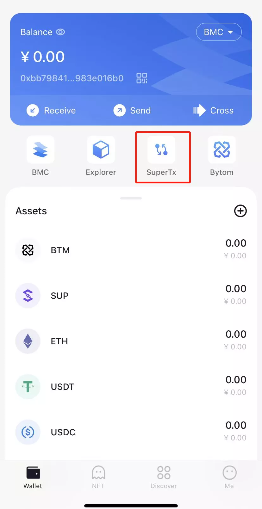

Enter the main page

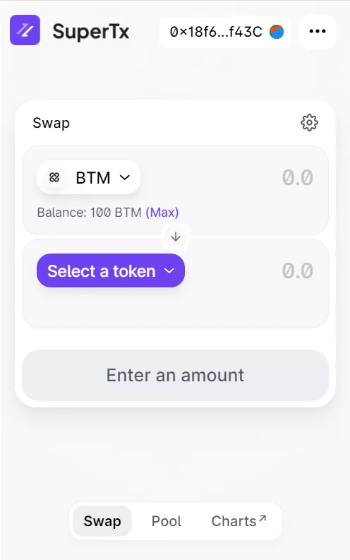

### 4. Use the SuperTx

Select the exchange pair, take BTM-USDT as an example, and enter the exchange amount

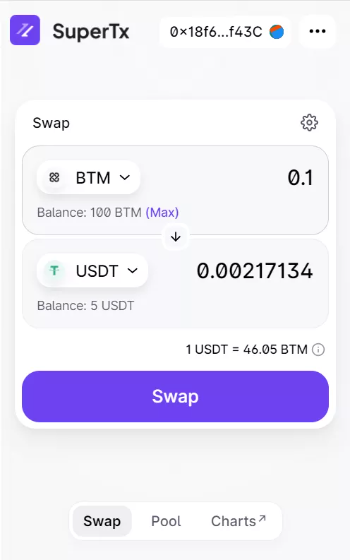

Click Swap and confirm

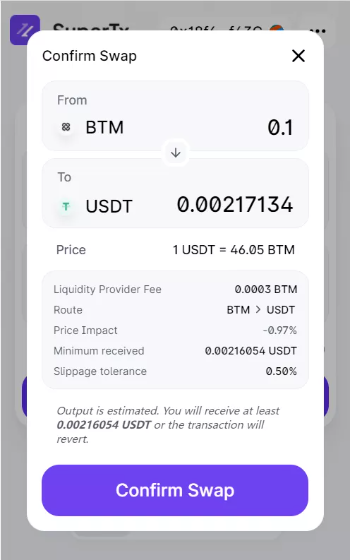

Enter the password to confirm the transaction

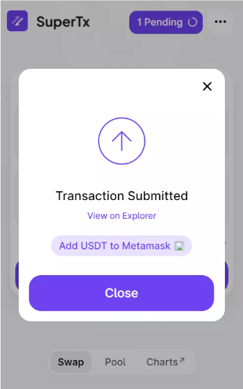

Exchange successfully

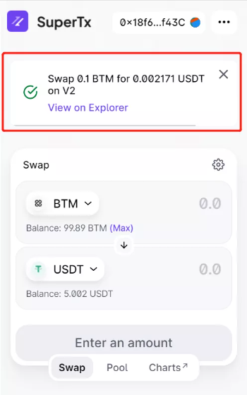

### 5. Create or add a superTx pool

Users can add assets to the superTx pool to earn 

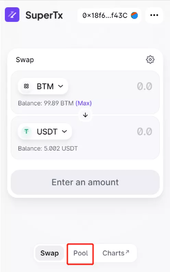

Select Pool on the main page to enter the liquidity pool 

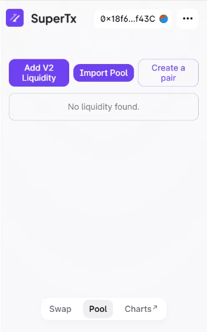

Choose “Add V2 Liquidity" or "Creat a pair"

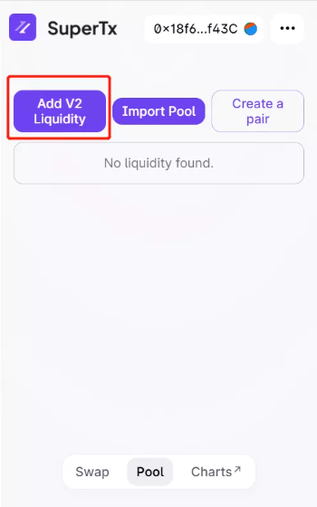

If the pool already exists, you can add an asset directly

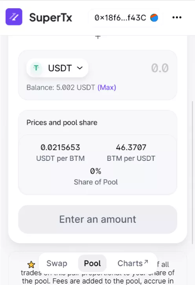

If the pool does not exist, you need to set the two assets added

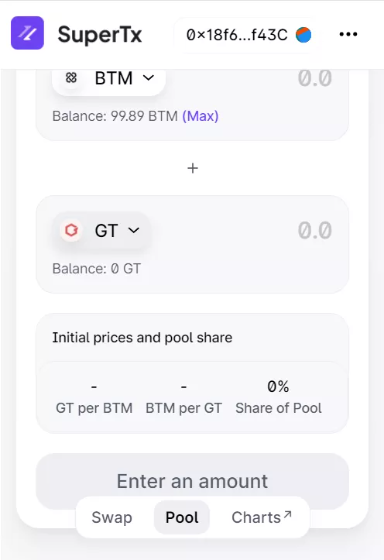

"Approve"

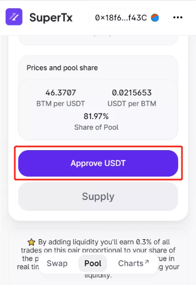

"Supply"

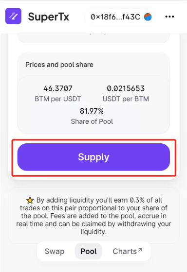

Successfully and obtain the certificate

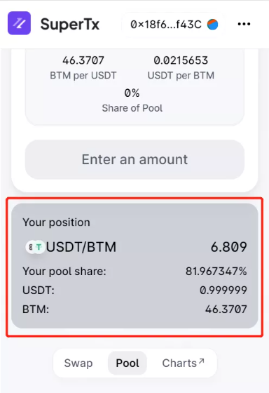

