## BMC超导流动性挖矿教程

### 1. Preparation

Update to Bycoin2.9.0 and creat a BMC wallet: https://blockmeta.com/wallet

Prepare BTM、BTMC or SUP

### 2. Add SuperTx Pool

Click “ SuperTx ”

Enter the main page of SuperTx exchange

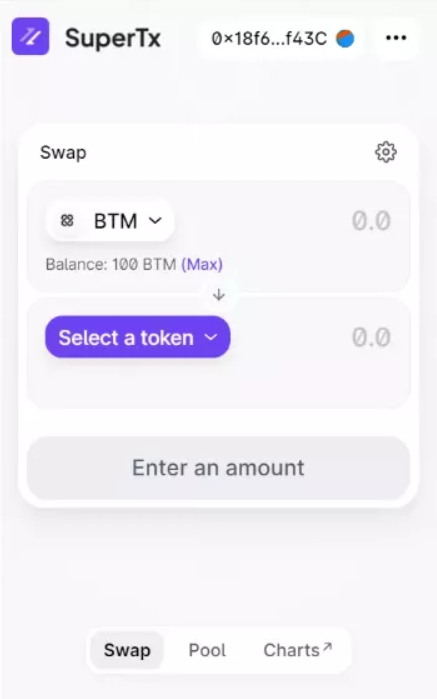

Choose “ Pool ”

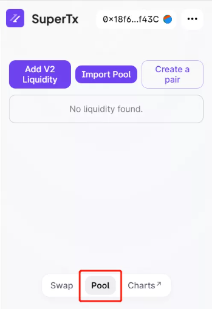

Click “ Add V2 Liquidity ”

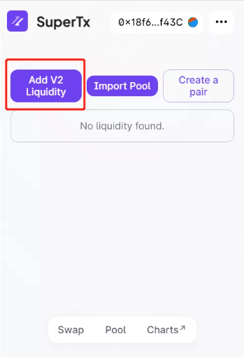

Choose BTM-SUP or BTM-BMTC pair

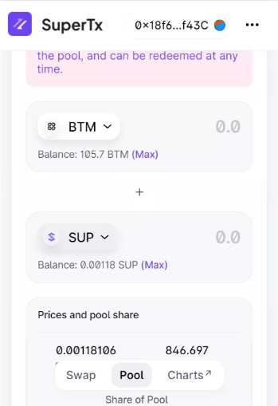

Enter the quantity

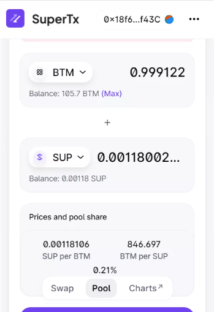

Agree to the SUP contract, enter the wallet password, and wait for confirmation

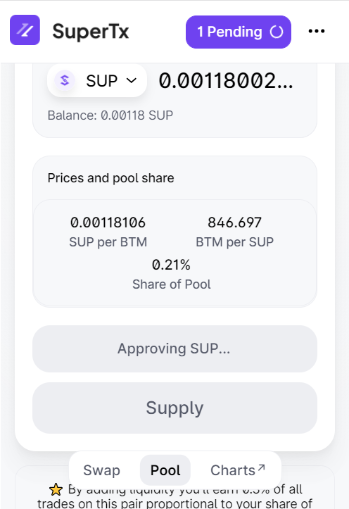

Click “SUPPLY”, enter the wallet password, and wait for confirmation

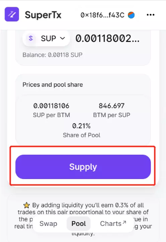

Successfully, you will see the information, and just wait for earnings

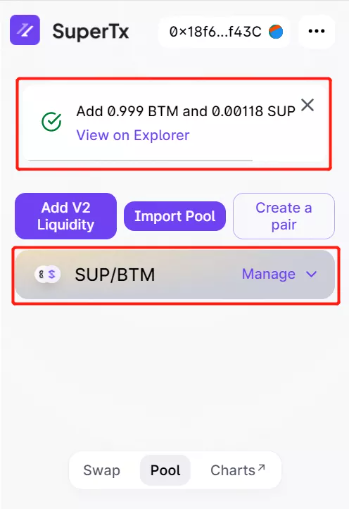

### 3、Check the Assets Informations of SuperTx Pool

Click “Charts” or visit https://info.sup.finance/home

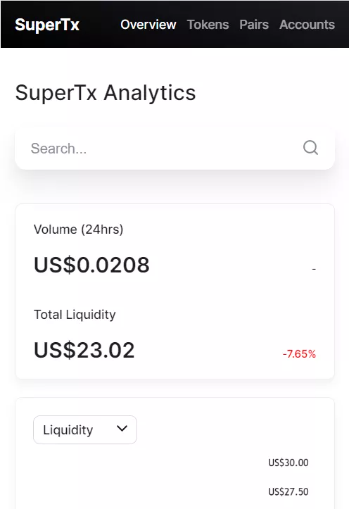

Choose “ Pairs ” to check the transaction information

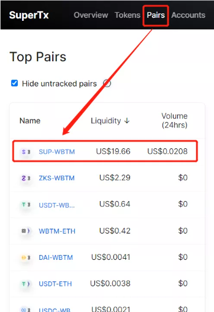

You can view the price of the transaction pair and the total value of the pool assets

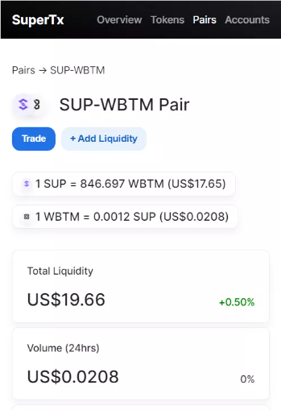

Click “ Account “ to check own address

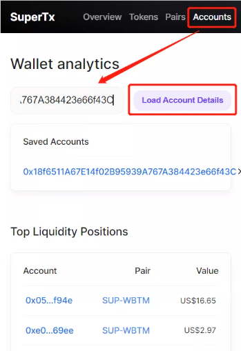

Check the information of address

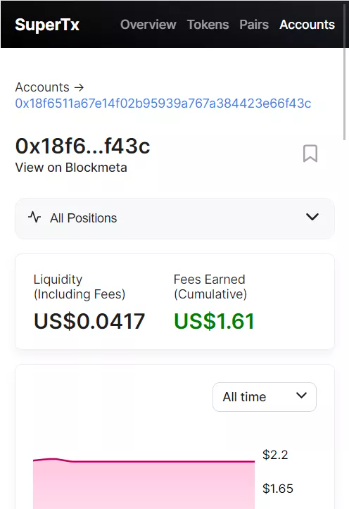

According to the personal assets and the total value of the pool, the approximate income can be calculated.
