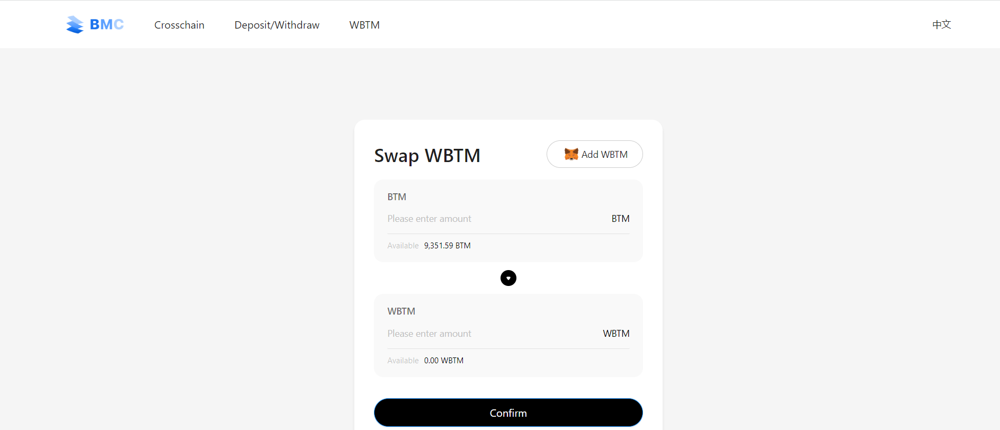
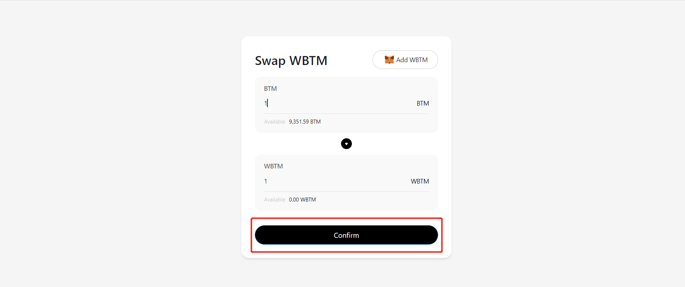
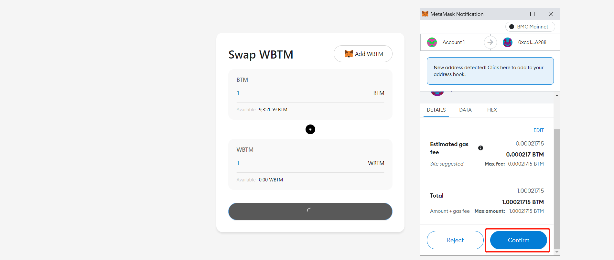

## WBTM：Conception and Use

### Abstract

WBTM (Wrap BTM) is the BAP20 token that 1:1 to BTM on BMC (Bytom Sidechain). As the native token of BMC, BTM can be paid for gas, but it cannot be easily called by contracts and cannot be used in Dapps, so WBTM is required to play its role.

WBTM can be exchanged 1:1 to BTM at https://wbtm.bytom.io/

### What's is WBTM?

WBTM (Wrap BTM) is the BAP20 token that 1:1 to BTM on BMC (Bytom Sidechain). As the native token of BMC, BTM can be paid for gas, but it cannot be easily called by contracts and cannot be used in Dapps, so WBTM is required to play its role. Compared with BTM , WBTM has wider applicability.

### Why we need WBTM?

BMC (Bytom Sidechain) is compatible with EVM with powerful smart contract functions. But as a chain native token, BTM cannot directly interact with smart contracts (transfer is required), so a BAP20 format token is required to undertake this function, WBTM came into being.

For example, in the Maze protocol, NFT needs to add deposit to set the price, which cannot be done by BTM. Under this condition, WBTM needs to be exchanged to meet the needs.

### How to get WBTM?

WBTM can be exchanged 1:1 to BTM at https://wbtm.bytom.io/

fill in the number you want to swap

wallet confirm

finished, you can add WBTM to your wallet