## Tutorials of BMC SuperTx（Web）

### 1. Download Metamask

https://metamask.io/ 

### 2. Switch to BMC network

可以手动添加BMC网络

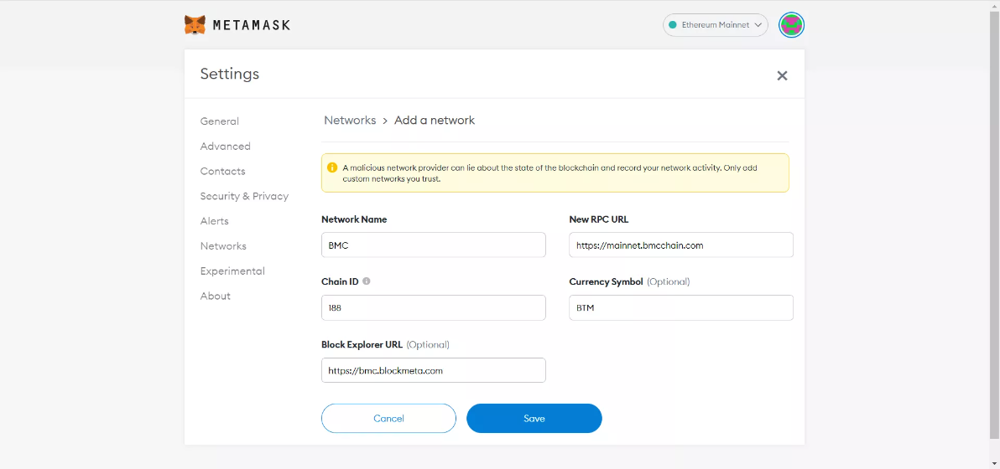

Network Information：

- NetWork Name: BMC
- RPC URL: https://mainnet.bmcchain.com
- Chain ID: 188
- Currency Symbol: BTM
- Block Explorer URL: https://bmc.blockmeta.com/

Or use Chainlist

https://chainlist.org/

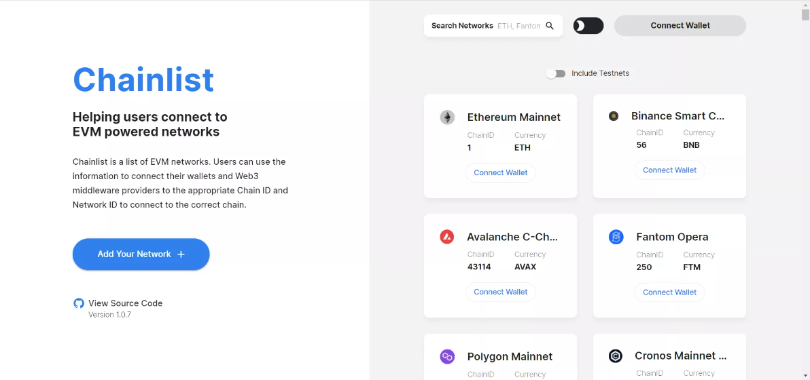

Search BMC

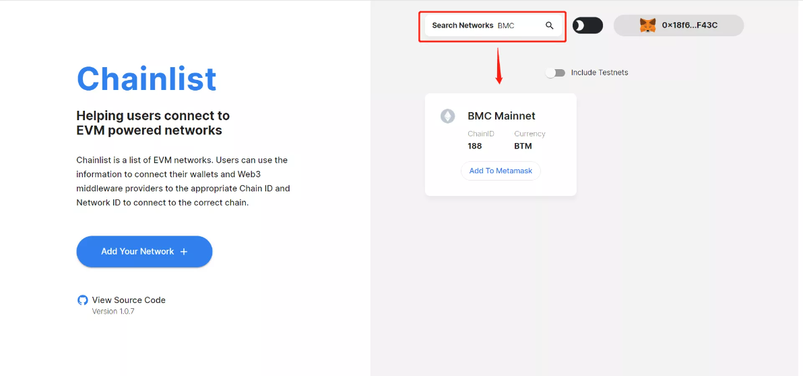

Click "Add To Matamask"

### 3. Enter the SuperTx

https://sup.finance/#/swap

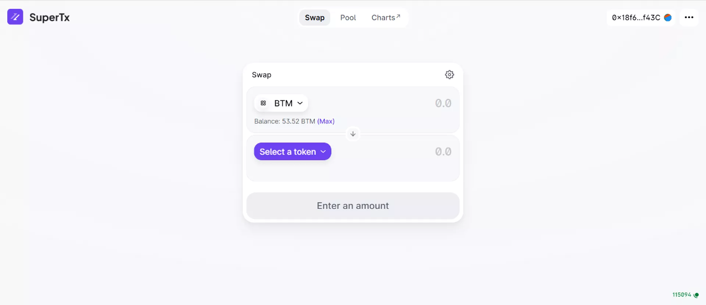

### 4. Use the SuperTx

Select the exchange pair, take BTM-USDT as an example, and enter the exchange amount

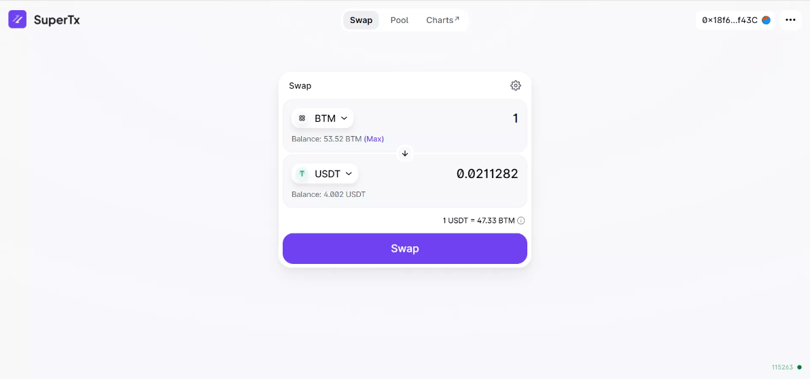

Click "Swap" and confirm

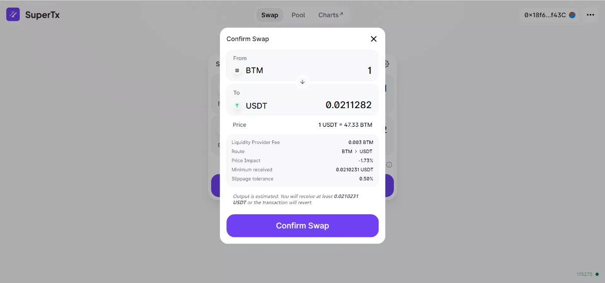

Click "Confirm"

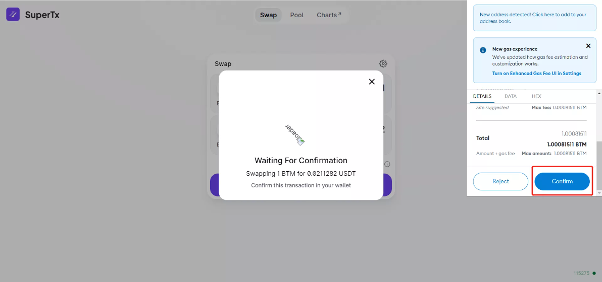

Swap successfully

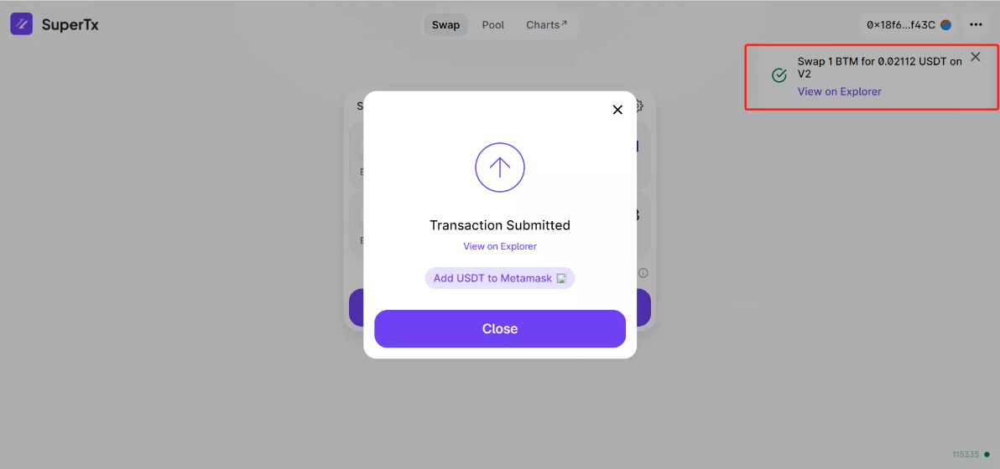

### 5. Create or add a superTx pool

Click "Pool"

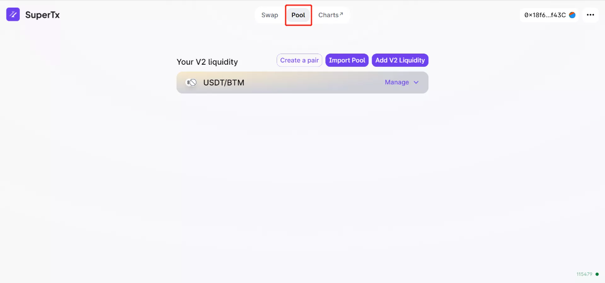

Choose "Creat a pair" or "Add V2 Liquidity"

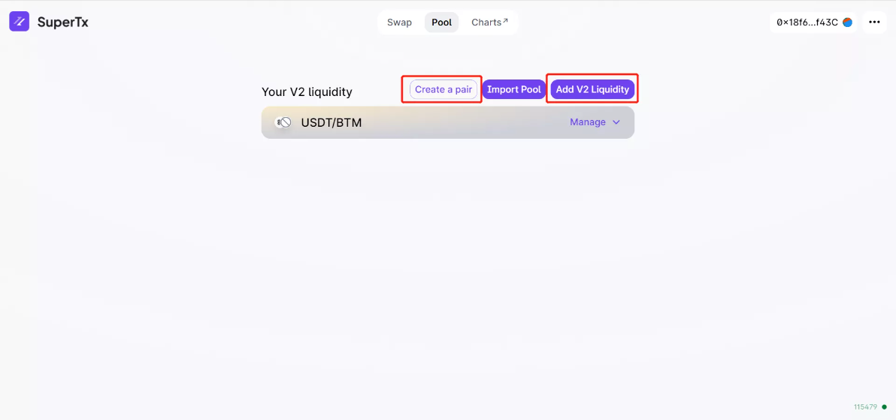

Select the coin and quantity and Click "Supply"

"Confirm Supply"

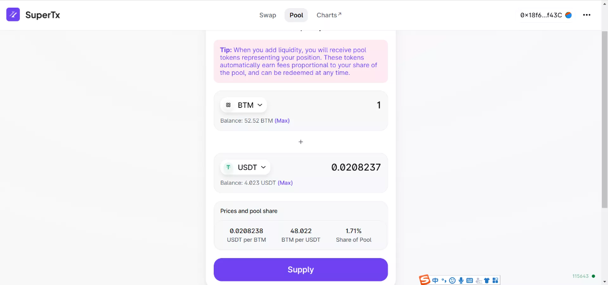

Confirm the transaction in the Metamask

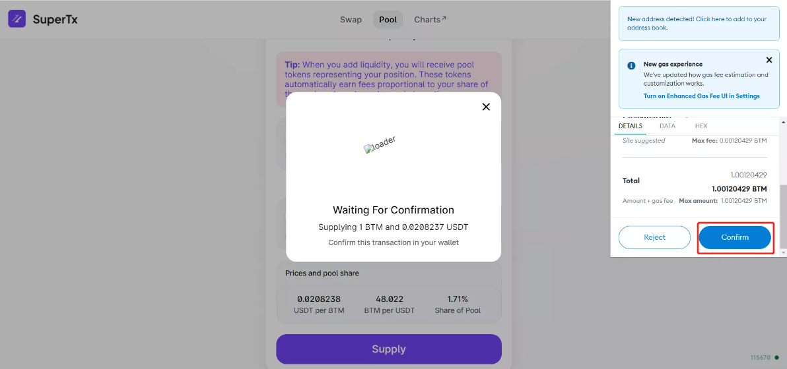

Swap Successfully

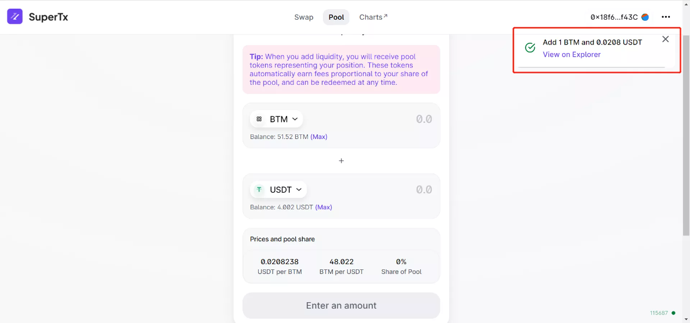