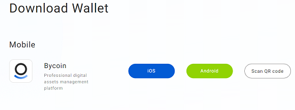
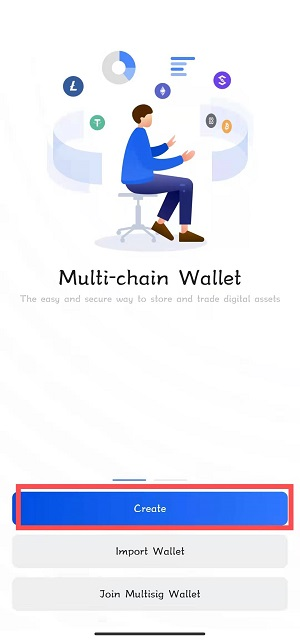
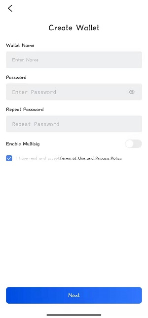
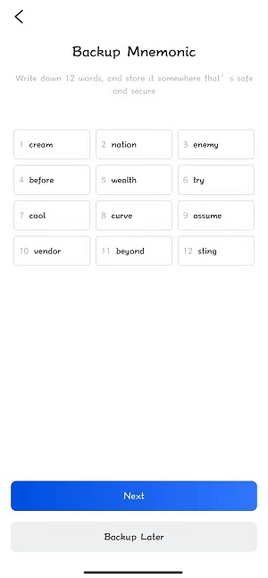
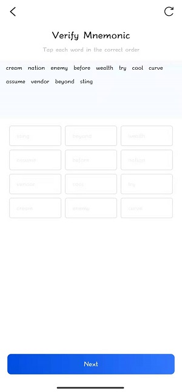
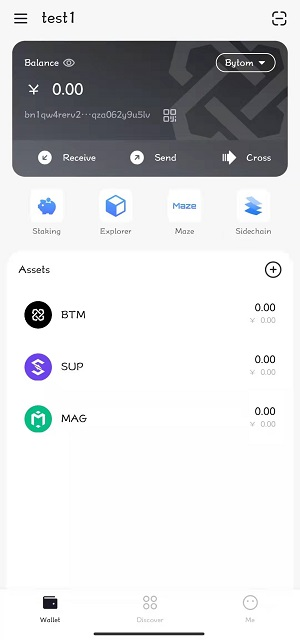
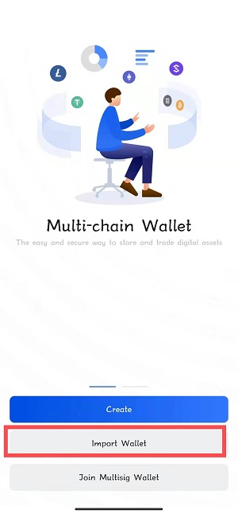
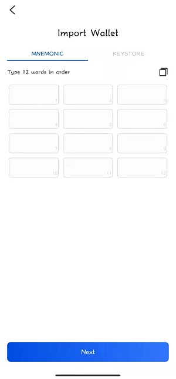
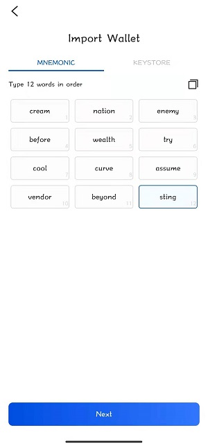
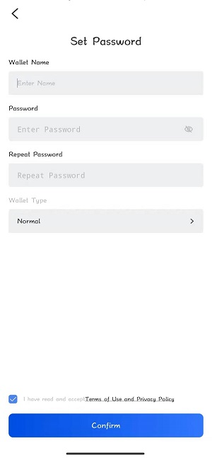

### 1. Install Bycoin

**1.1 Android device users**

Visit the official website of Bycoin Wallet: [https://blockmeta.com/wallet/](https://blockmeta.com/wallet/) Click on [Android] or [Scan QR code].

**1.2 IOS device users**

Visit the official website of Bycoin Wallet: [https://blockmeta.com/wallet/](https://blockmeta.com/wallet/) Click on [IOS] or [Scan QR code].

### 2.Create a wallet

**2.1 Create a wallet**

Click create wallet.

**2.2 Enter new wallet information**

Enter the new wallet confirmation password, enter the confirmation password again.

**2.3 Backup mnemonic**

Please keep the mnemonic words in mind, if lost, the assets in the wallet will not be able to be retrieved.

**2.4 Verification mnemonic**

After successfully backing up and verifying the mnemonic phrase, the creation is successful.

**2.5 Created successfully**

After successfully backing up and verifying the mnemonic phrase, enter the Bycoin homepage.

### **3.Import wallet**

**3.1 Choose to import wallet**

**3.2 Choose how to import wallet**

You can import the wallet through mnemonic or KEYSTORE.

**3.3 Enter the mnemonic phrase and import it into the wallet (recommended)**

Enter the mnemonic phrase in the order of backup.

**3.4 Set wallet name and password**

After the mnemonic phrase is recognized correctly, set the import wallet name and confirm the password.

**3.5 Imported successfully**

After the wallet is successfully imported, enter the Bycoin homepage.

