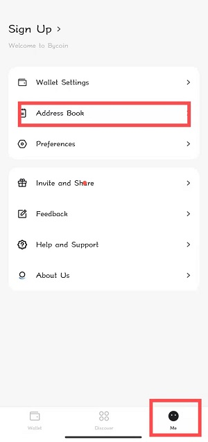
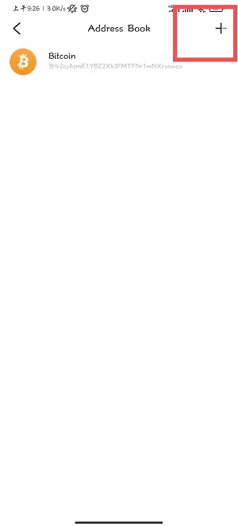
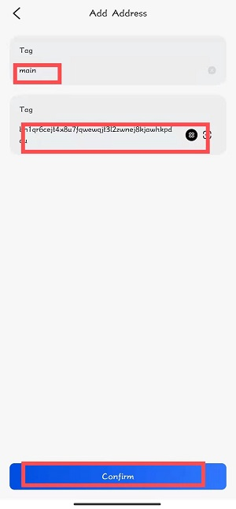
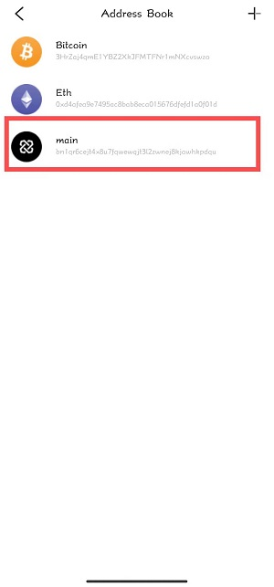
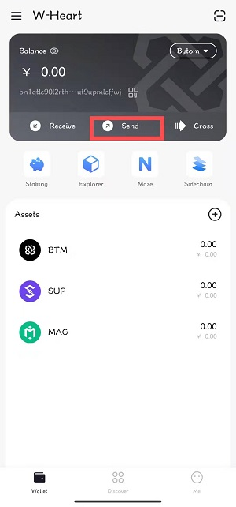
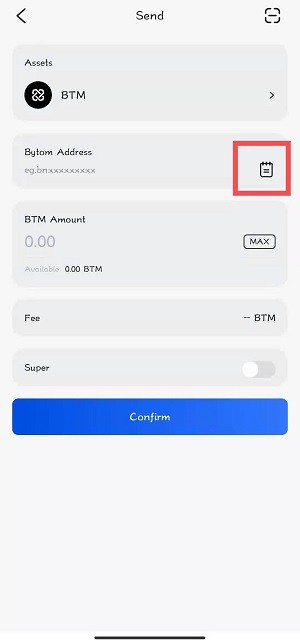
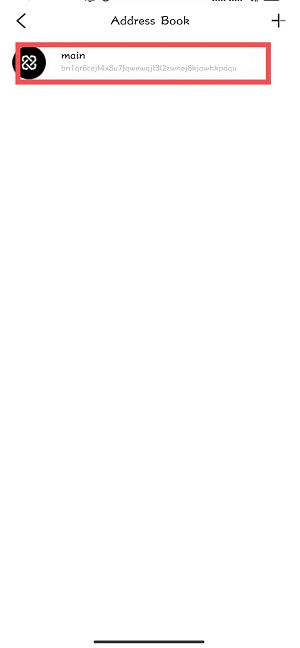
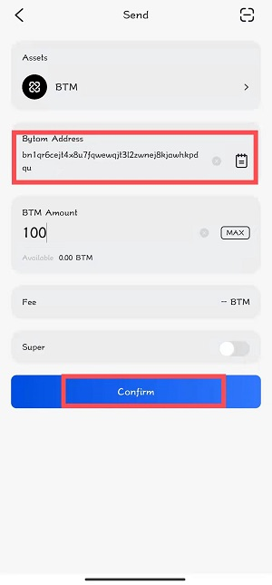

## Instructions for using the address book function

If we have several frequently used transfer addresses, it will be troublesome to paste and input each time. The **Address Book** function can just solve this problem.

### 1. Add address

Open Bycoin and select the **me** option in the lower right corner, select the **Address Book** function, and click to enter.

Click **+** in the upper right corner to enter the **Add Address** page.

Enter the address label and address, and click **Confirm**.

You will see the address you just added is displayed in the address book.

### 2. Use the address book

When we need to transfer money, click **Wallet** and select the **Transfer** function.

Click the small address book icon to use the address book function.

Choose the address you want to transfer money to.

Enter the transfer amount, click Confirm and enter the password to complete the transfer.

