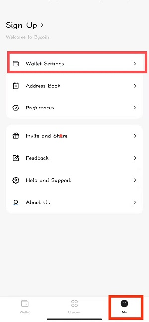
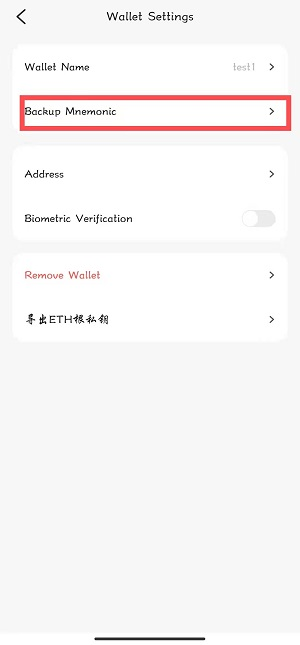
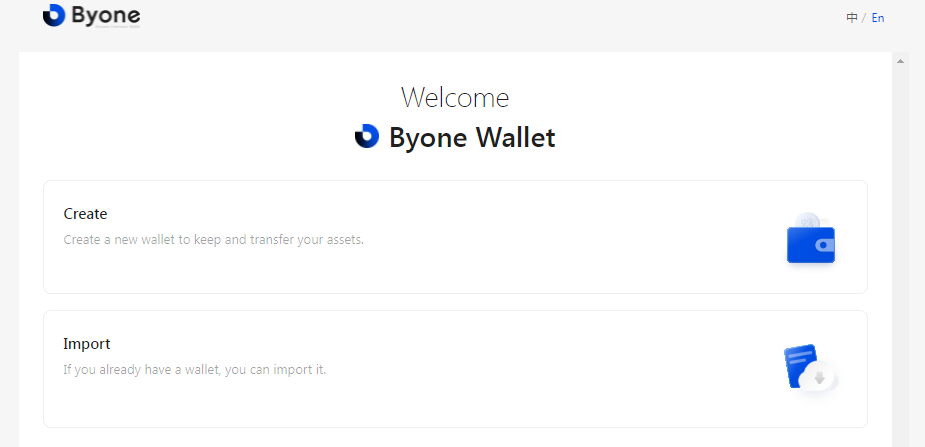
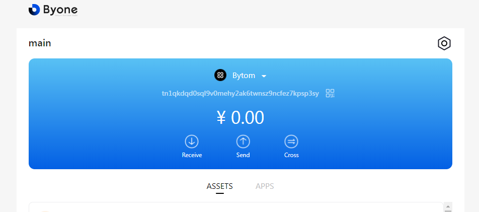
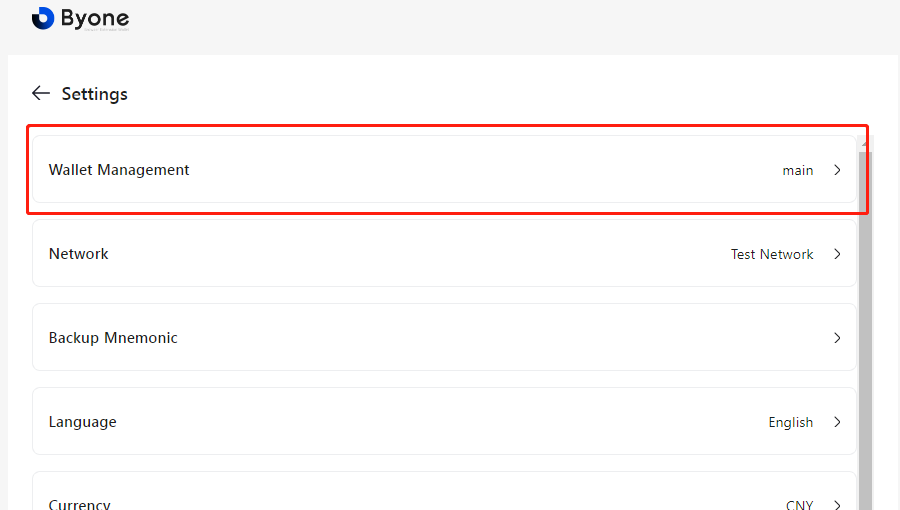
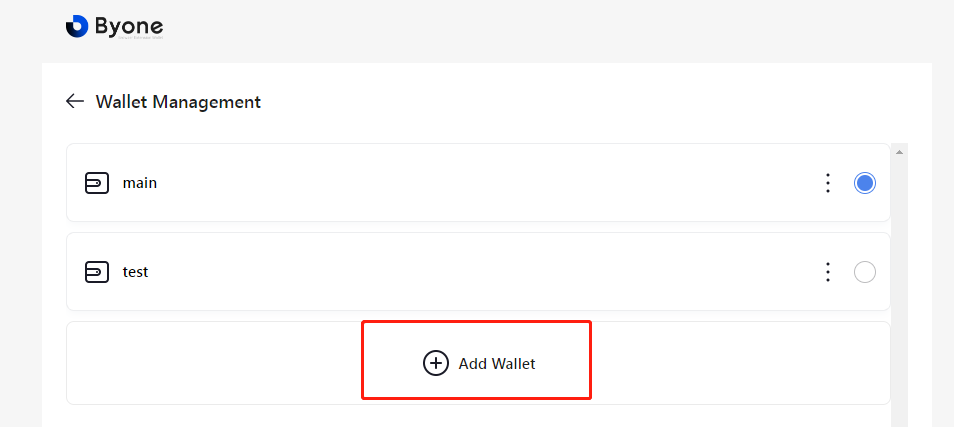
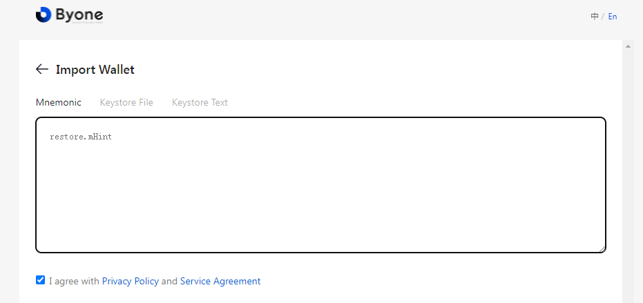
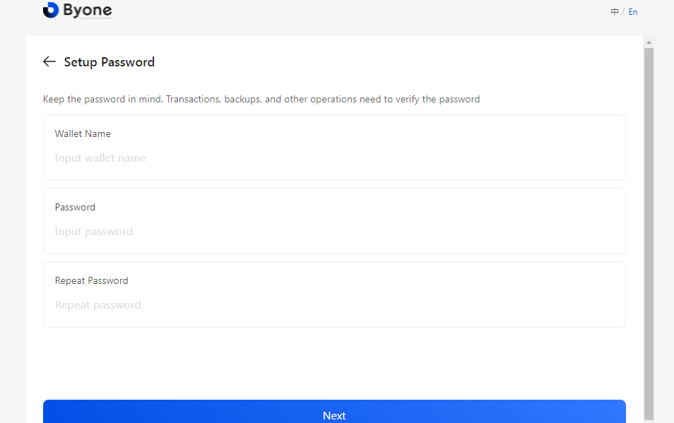
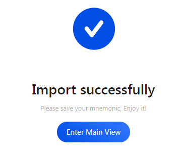

## Bycoin to Byone seamless migration solution

The MOV product line already supports both mobile and web terminals. Through the same set of mnemonics, the seamless migration of accounts from Bycoin to Byone can be completed.

### Export Bycoin mnemonics

On the "me" page in the lower right corner of Bycoin, select wallet settings and backup mnemonic in turn. After entering the password, please keep your mnemonic properly.

### Import mnemonic words into Byone

Newly installed users, please directly select the import wallet option.

For users who already have a Byone account, please click Settings in the upper right corner.

Click Wallet Management.

Click to add wallet.

After the mnemonic phrase is verified correctly, set Byone's wallet name and management password to complete the import.

You can go to the main page of Byone to browse all of your assets. The balance and operations of assets in Byone and Bycoin will be synchronized in real time.