## MOV Web connects Byone wallet

### 1、Install Byone
If the Google plug-in wallet-Byone is not installed on your device, you will not be able to use the related services under MOV-web.

Click to enter the website: https://supertx.bymov.io/swap#
Click "Connect Wallet" in the upper right corner.

#### 1.1、Install from Google Store (recommended method)

Select "Byone for Chomel" to visit the page.

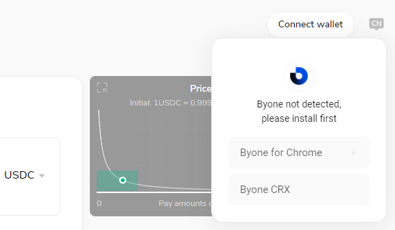

Click "Add to Chome" and choose to add an extension from the pop-up page.

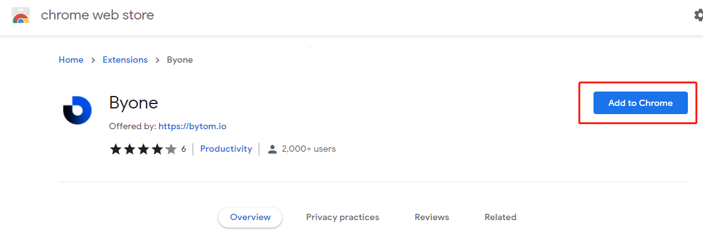

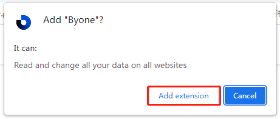

The installation will proceed automatically. After the installation is complete, you can find your Byone in the plug-in bar and lock it on the toolbar with the lock button.

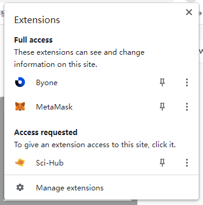

#### 1.2、Install via offline installation package

Hover the mouse to "CRX File Installation" and click "Download" to download the offline installation package with the file name "byone.crx" to the local.

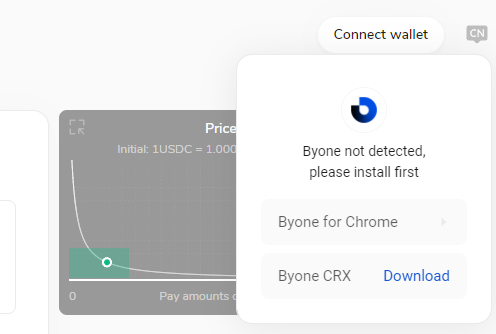

Click the Settings button in the upper corner of Google Chrome, select More Tools-Extensions in turn, and enter the plug-in management page.

Open the "Developer Mode" in the upper right corner, drag and drop the offline installation package you just downloaded to the extension bar, the browser will recognize the file and install it automatically.

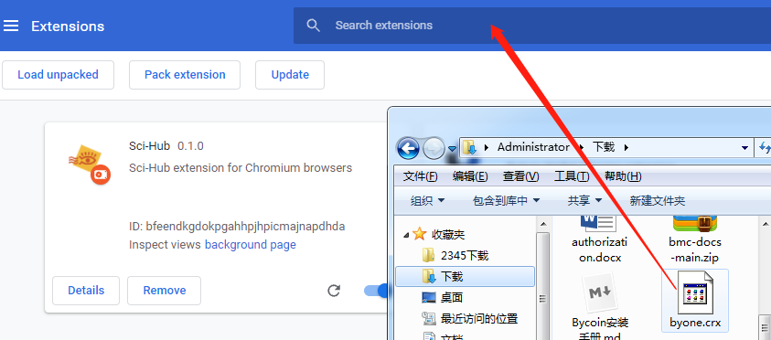

Installation is complete after loading successfully.

### 2、Create a new wallet

Click the Byone plugin, the first visit will pop up a page prompting you to create a new wallet, or restore your existing wallet.

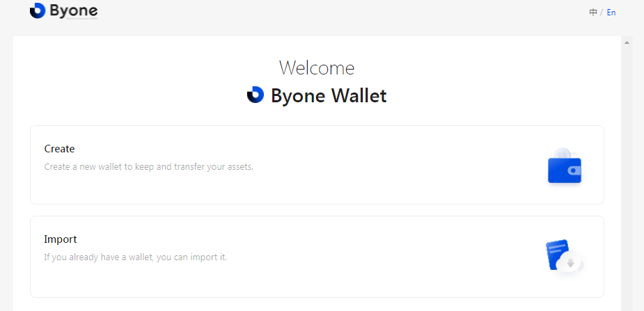

Please follow the process to create a wallet. (Set wallet name and password-backup mnemonic phrase-verify mnemonic phrase).

Be sure to save the generated mnemonic phrase, this is the only way for you to restore your wallet. Once the mnemonic phrase is lost, the digital assets in your wallet cannot be retrieved.

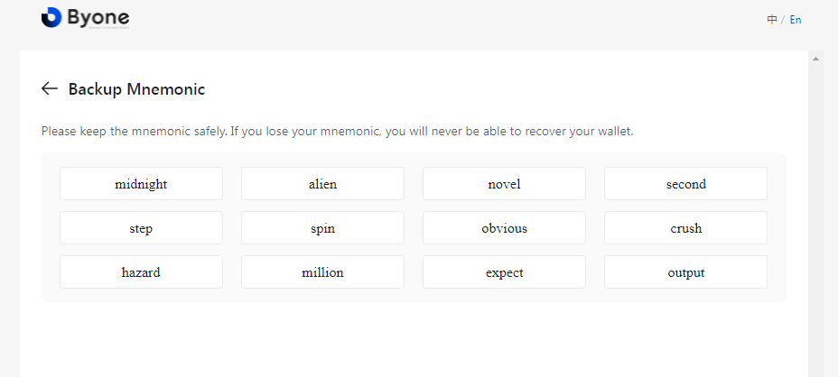

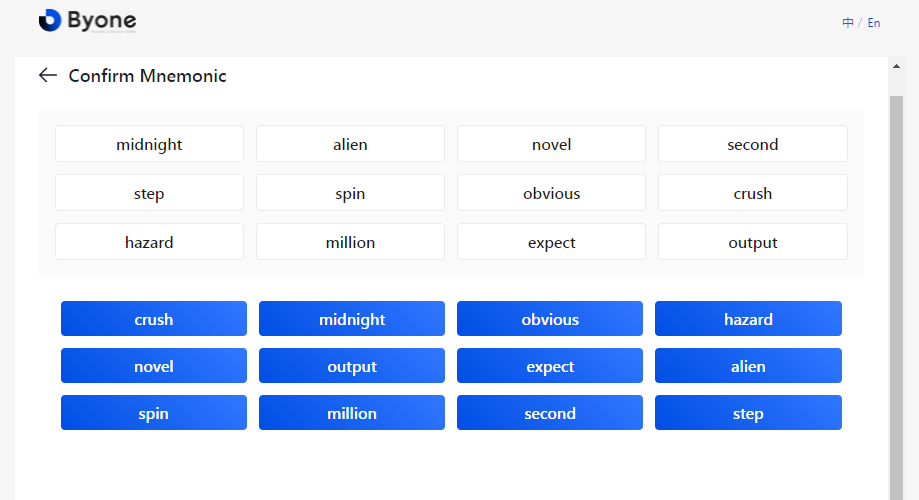

After successful creation, you can use your Byone.

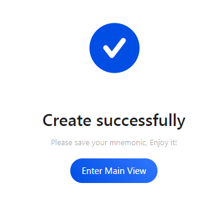

### 3、Import wallet

Choose to import the wallet, you can import it in three ways: mnemonic phrase, keystore, keystore plain text (mnemonic phrase is recommended).

Please enter your mnemonic words in order, separated by spaces.

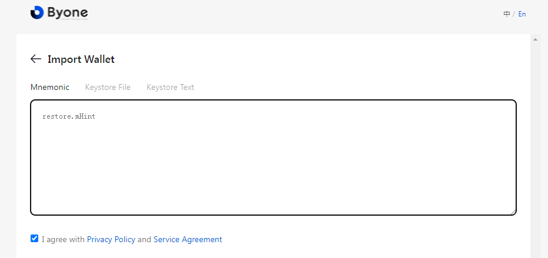

After the mnemonic phrase is recognized correctly, please set the wallet name and password.

Imported successfully.

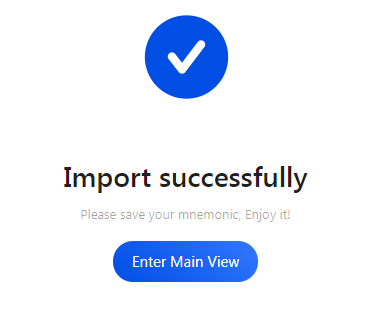

### 4、Visit MOV-web and connect to Byone

After installation, you need to connect to Byone to access MOV-web for the first time before you can use related functions normally.

First switch Byone to the side chain, click the drop-down arrow at the top.

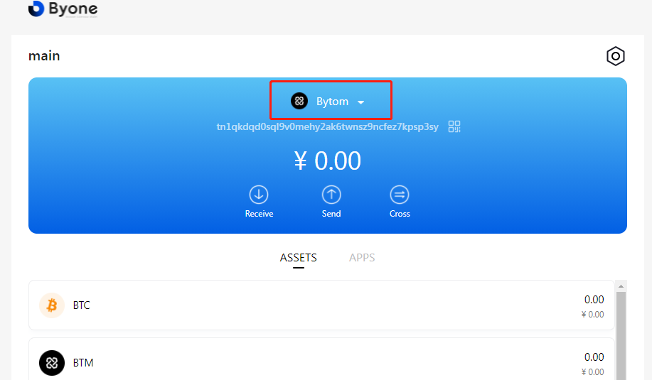

Choose Sidechain.

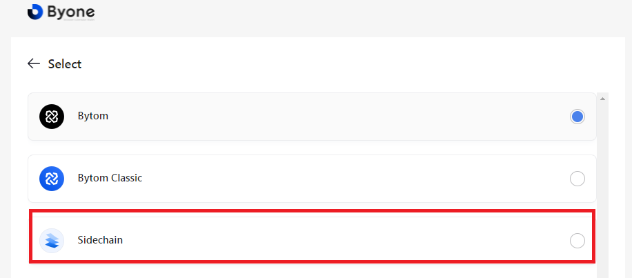

Click to connect Byone.

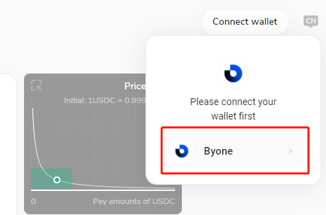

After the connection is successful, the page has displayed your wallet connection status information.

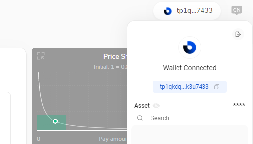

Next, you can already use the related functions of MOV-web!