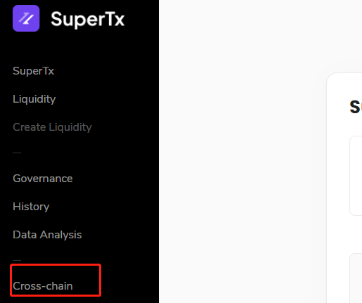
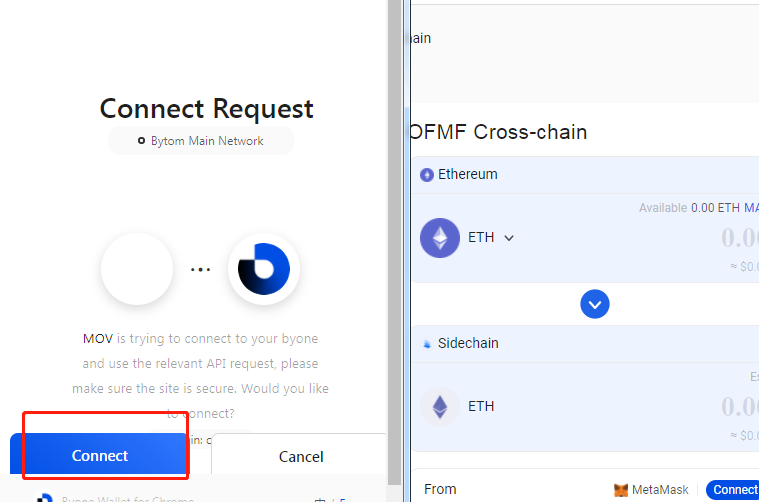
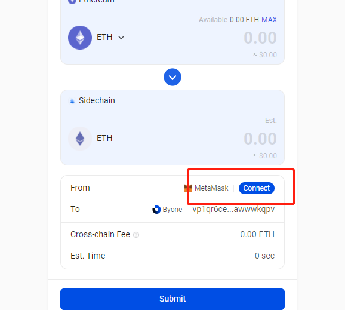
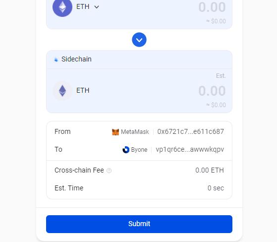

## Web cross-chain tutorial

Open the link: https://supertx.bymov.io/swap

At present, MOV-web can support the cross-chain function of ETH, USDT, USDC, and DAI on the Ethereum network through MetaMask. You can select the cross-chain function on the left.

### Connect wallet

Before using the cross-chain, please install MetaMask and Byone's Google plug-in, and back up in time.

On the cross-chain page, click the connect button under the wallet icon to call up authorization prompts to connect.

Byone authorized connection:

Click on MetaMask to authorize the connection:

connection succeeded:

### Address binding

When you use the cross-chain function for the first time, you need to associate your ETH address with the MOV address first, which will take a certain amount of time and consume a certain amount of gas to run the contract.

After the binding is completed, the button changes to "Confirm", and the cross-chain function can be used.

### Minting/Financing

You can switch the operation mode through the TAB in the upper right corner, and decide to use the Ethereum assets in MetaMask to "mint coins" to Byone.

Or "monetize" MOV assets from Byone to MetaMask.

The system will automatically read the available asset balance in your wallet and estimate the handling fee.

If you have other addresses to receive assets, you can also use the address switch button to "mint/find coins" to your manually filled address.

After confirming the currency and quantity, click Confirm, and the corresponding wallet will pop up a window to prompt you to authorize the transaction.

Please pay attention to the final amount on the settlement page. The actual transaction amount is subject to wallet settlement.

After confirmation, you can see that the transaction has been submitted, waiting for the mainnet to confirm.

### Finish

After you submit your request, the feedback snapshot page will display the cross-chain information you applied for.

After returning to the homepage, you can browse the progress of your cross-chain application submitted and your previous cross-chain records through the history records in the upper right corner.
