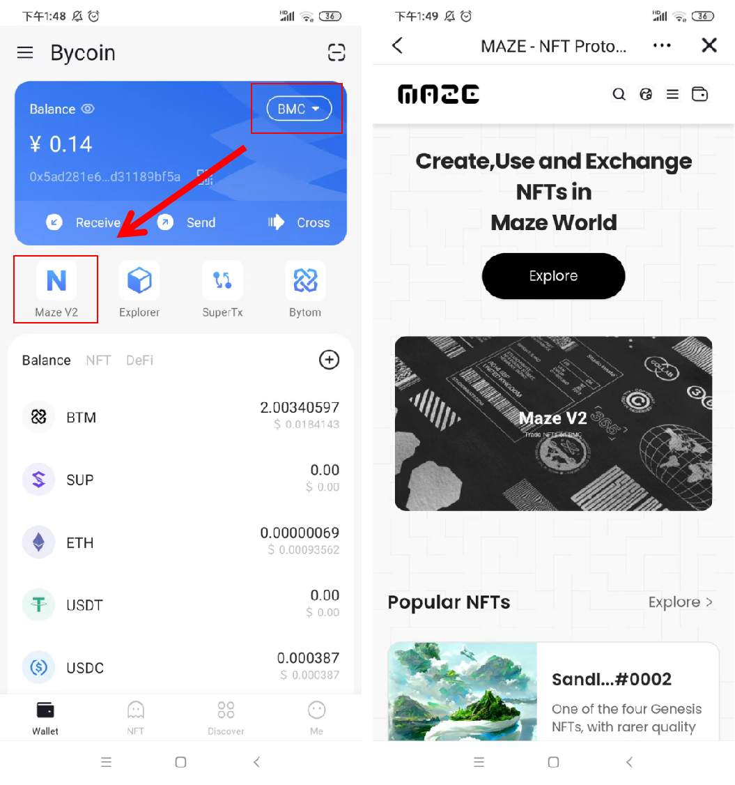
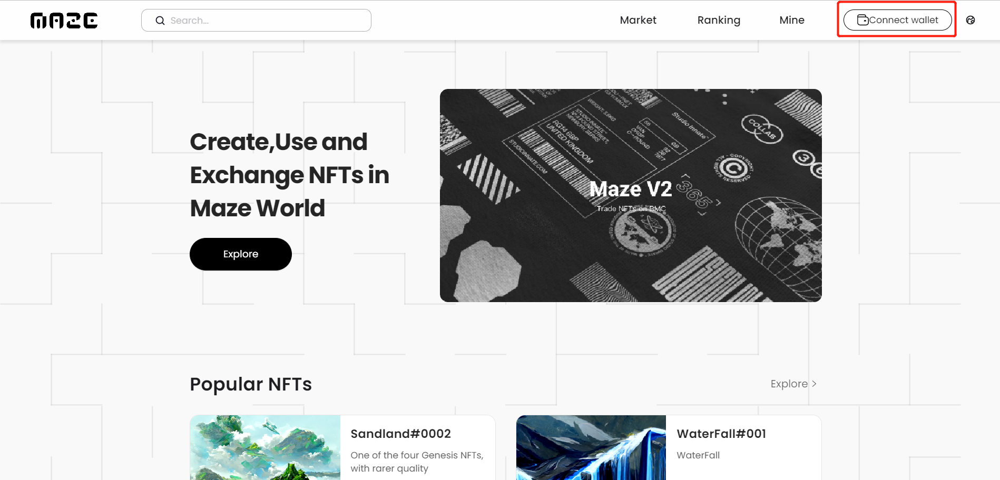

## Artist Application Process on Maze platform

### 1. Mobile

#### 1.1 Enter Maze platform

In bycoin, switch the network to Bytom, click the Maze icon to enter Maze platform.

#### 1.2 Apply for Artist

**1.2.1 Entrance to apply for being an artist**

After entering the Maze platform, move to the bottom of the website and click [Apply for being an artist]

**1.2.2 Fill in the information**

Please fill in the information as required

**1.2.3 Submit**

After filling in the information, click the [Submit], and enter the audit status.

**1.2.4 Result**

The result will be given to the users within five working days. After passing the audit, artists can enter the [NFT Mints] page. Users who do not pass the audit can reapply.

#### 1.3 Become an artist on Maze platform

Users who have passed the audit and become an artist can click [Mine] on the navigation bar to enter page, and check the artist certification, modify the name and profile.

### 2.Web

#### 2.1.Enter Maze platform website

Enter the URL in browser: https://v2.maze.market/

#### 2.2.Apply for being an artist

**2.2.1 Wallet Connect**

Connect Byone wallet on Maze platform 

Authorization is displayed, click Connect.

After the connection is complete, the page will display the address start with"bn"

**2.2.2 Entrance to apply for being an artist**

After entering the website, move the page to the bottom and click [Apply for being an artist]

**2.2.3 Fill in the information**

Please fill in the information as required

**2.2.4 Submit**

After filling in the information, click the [Submit], and enter the audit status.

**2.2.5 Result**

The result will be given to the users within five working days. After passing the audit, artists can enter the [NFT Mints] page. Users who do not pass the audit can reapply.

#### 2.3 Become an artist on Maze platform

Users who have passed the audit and become an artist can click [Mine] on the navigation bar to enter page, and check the artist certification, modify the name and profile.

