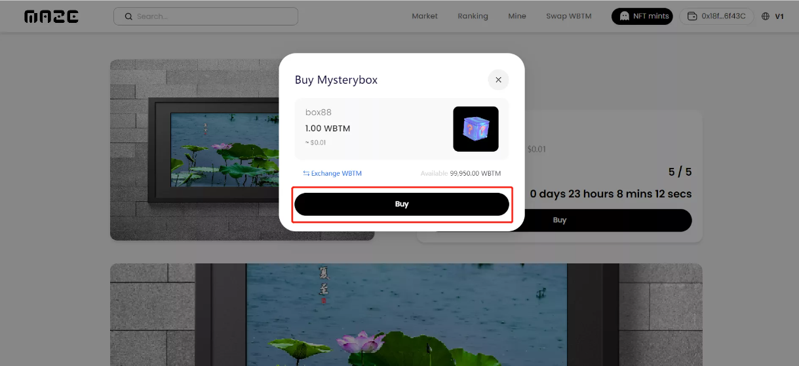

## Maze Blindbox Guide

Enter Maze Website: [MAZE - NFT Protocol](https://v2.maze.market/)，click the activity banner or enter the domain name 

Join the blind box activity website

Click to connect wallet, after connection, it will show your wallet address

Click "Buy"

The tooltip will jump out, click "Buy", if you don't have WBTM, you need to transfer some WBTM, if you haven't authorized WBTM, you need to authorize

Click " Sign" in the wallet 

Now you have own the NFT 

Check your NFT 

