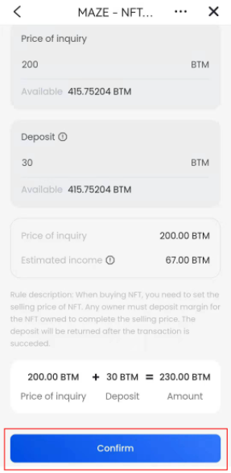

## Mobile Manual for MAZE Platform

### Enter the MAZE Platform

#### 1.Bycoin version

Users need to update Bycoin to version 2.8.2 or higher to display the maze protocol option.

#### 2.How to enter the MAZE Platform

Open Bycoin, and click 【Maze】in the Bytom mainchain interface to enter the MAZE Platform.

### the MAZE Platform navigation

After entering the MAZE Platform, you can click the navigation bar in the upper right corner to jump to the function page of the maze protocol. At present, the navigation bar of the Maze protocol can jump to 【NFT casting】, 【market】, 【ranking】, and 【Mine】.

### MAZE Platform Center

#### 1. How to enter 【Mine】

Users can click 【Mine】 through the navigation bar to enter.

#### 2.【Mine】Information

After entering 【Mine】, users can see their 【Bytom main chain address】, 【Have NFT total margin】 【Currently owned】, 【Bought】, 【My casting】, 【My Buying】

#### 3. Edit and modify personal information

At present, the operations in the MAZE Platform are bound to the Bytom mainchain wallet address of the user's wallet, so the address cannot be modified. Click the Edit button to modify the name and self-description displayed by yourself. After filling in, click Confirm. This operation requires a confirmation signature. Click Confirm Signature and enter the wallet password to display the changed information on the 【Mine】 page.

### 四、How to view NFT in the MAZE Platform

#### 1.View the MAZE Platform NFT

**View NFT on the homepage**

On the homepage of the MAZE Platform, users can browse down and jump to the market/ranking list by clicking 【Hot Collection】, 【Hot Deals】, 【Popular Artists】, 【Rare NFT】, 【View More】option, Make purchases.

**Choose NFT in the market**

Click on 【Market】 through the navigation bar to enter the MAZE Platform. Users can sort the works according to the NFT popularity and add one in ascending and descending order, and they can also perform keyword search for the name of the NFT work.

#### 2.Click on the NFT image to enter the transaction page

Entering the transaction page will display the original NFT work, the name of the work, the description of the NFT work, the caster, the current owner, the price, the work deposit, the casting time, and the royalty information.

#### 3.Transaction records and purchase records

Below the NFT work, you can freely view each transaction record and purchase record of the work. Click the link button at the back to directly jump to the block explorer to view the status of the record.

### How to buy NFT in MAZE Platform

#### 1.Own now

**Click NFT works**

Under the selected NFT work, click the 【Own Now]】button to enter the immediately own transaction page. At the top, the current price of the NFT works is displayed.

**Enter the margin**

According to the aggressive trading model, the user needs to enter the deposit for holding the NFT work below. After the input is completed, the system will automatically calculate the total fee to be paid, the selling price and the estimated income information.
NFT selling price=margin x10 For example: fill in the margin as 10BTM, then the selling price of the NFT will be 10x10=100BTM.
The estimated income is the income after the purchase and the successful sale. The estimated income = sale price x (1-work royalty ratio-platform fee ratio)-purchase price.
For example: the purchase price is 100BTM, the selling price is 120BTM, and the royalty is 10%, then the expected income is 120 x (1-10%-1%) -100 = 6.8 BTM

**Confirm the price**

After confirming the total cost, click the 【Confirm】 button to verify the wallet password and complete the immediate possession transaction.

**Check the NFT owned by the transaction**

After completing the immediate possession transaction, a transaction record will be left under the work, and the NFT holder can make changes, and the holder can view it in 【Mine】 【Currently Owned】.

#### 2.Buying transaction

**Click NFT works**

Under the selected NFT work, click the 【Buy】 button to enter the purchase transaction page. At the top, the current price of the NFT works is displayed.

**Enter the purchase price and margin**

The user needs to enter the purchase price first (the purchase price must not be higher than the current price). According to the aggressive trading model, the user needs to enter the deposit for holding the NFT work below. After the input is completed, the system will automatically calculate the total cost to be paid and sell Price and estimated income information.

**Confirm**

After confirming the price, click the 【Confirm】button to verify the wallet password, complete the purchase transaction operation, and wait for the NFT work holder to agree to the bid purchase transaction.

**purchase record**

The completed purchase operation can be viewed in the purchase record under the corresponding NFT work or in 【My Purchase】in 【Mine】

**cancel**

Users can cancel the purchase order on the NFT details page.

### Mint NFT

#### 1.Enter the NFT minting page

#### 2.upload file

The currently supported upload formats are: JPG, PNG, GIF (more format types will be supported in the future according to product updates), and the maximum file size supports 100MB.
After uploading the page, the user fills in the name of the work, the price of the work, and the proportion of royalties in order (the official recommendation is 10%, the maximum setting value is 50%, and the caster can get royalties after each transaction is completed) and the work describe.

#### 3.Confirm

After completing the filling, click the 【Confirm Casting】 button, verify the signature, enter the wallet password, and complete the NFT casting to jump to the NFT work details page.

#### 4.adjust the price

The artist can adjust the price on the corresponding NFT work detail page

#### 5.My NFT

The NFT works that have been cast can be viewed in 【My Casting】 in 【Mine】

### Ranking

#### 1.Enter the Maze Platform rankings

After entering the Maze platform, click 【Ranking】 in the navigation bar to enter the Maze platform ranking list

#### 2.View the Maze platform Ranking

After entering the ranking page, the page defaults to 【Artist Ranking】, and users can manually switch to view 【NFT works sold in the past 7 days】 and 【Buy NFT works】 rankings.

