## Web Manual for MAZE Platform

### 1. Install Byone

If you do not have Byone (Google Plugin Wallet) , you will not be able to use the following functions.
Byone install tutorial: [Byone](https://support.maz.network/zh/byone/Web-connect-Byone.html)

### 2. Enter Maze platform, connect wallet

Open browser, enter [https://maz.network/](https://maz.network/), then click [Connect Wallet]

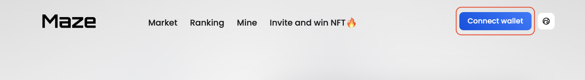

Confirm the connection and your address will be displayed

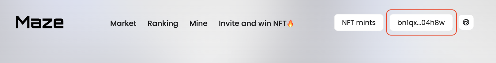

### 3. Navigation Bar of Maze platform

You can use the navigation bar to access to [Market], [Ranking], [Mine] page.
If you are an artist, you can mint NFT.

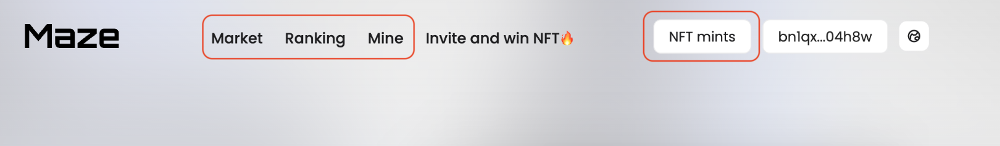

### 4. Profile page

Click [Mine] to access profile page, users can get information about [Bytom maichain address], [NFT total deposit you own],[Owns],[Bought], [Mints], [Inquires].

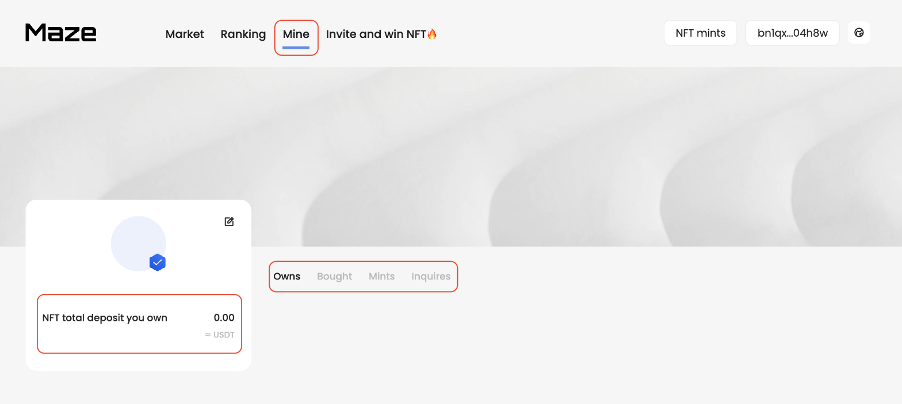

#### Edit personal information

Currently, the user's actions in the Maze platform are tied to the Bytom maichain address, it is not possible to change the address. Click the edit button to modify your name and self description, and click [Confirm] after the information is completed. This action requires a confirmation signature. Confirm the signature and enter the wallet password, the changed information can be displayed on the [Mine] page.

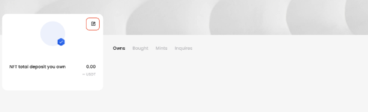
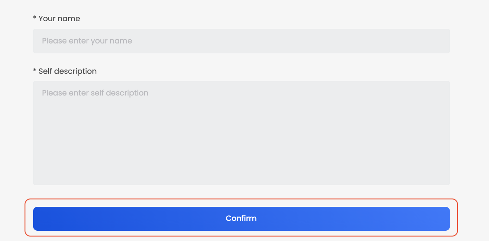

### 5. How to view NFTs in the Maze platform

#### 5.1 View NFTs

**5.1.1 View NFTs in the home page**

Users enter the home page of Maze platform, move the cursor and click [View more] of the options of [Popular NFTs], [Popular deals], [Popular artists], [Rare NFT] to jump to the [Market/Ranking] page and buy NFTs.

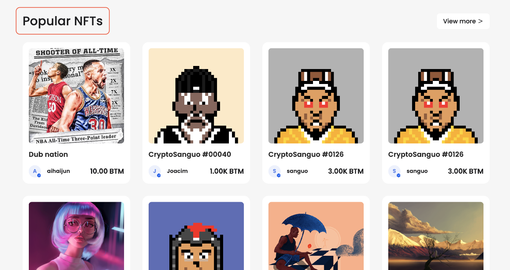
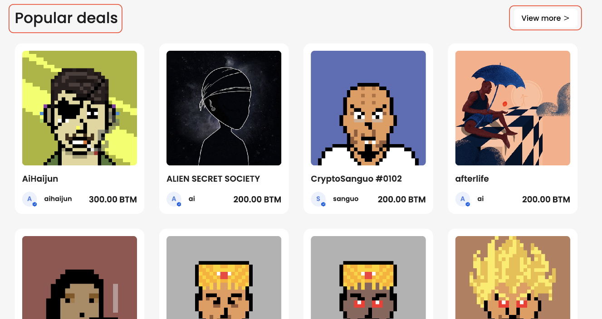

**5.1.2 Choose NFT in the market**

Click [Market] through the navigation bar to enter the Maze platform market, users can sort NFT by clout and price, or they can enter keywords to search for NFT.

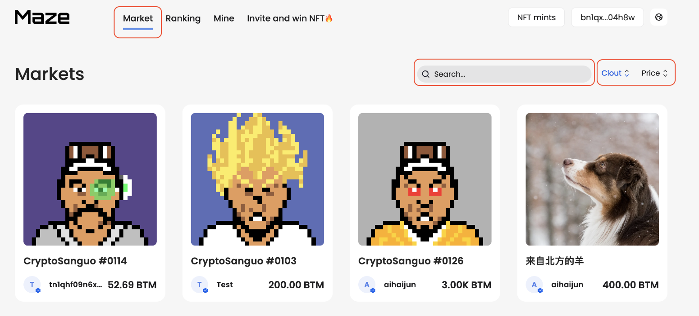

#### 5.2 Click NFTs to enter transaction page

The transaction page displays the title, description, the molder, minter, owner, margin, the time of minting, royalty information, and the attributes of the NFT (if contains).

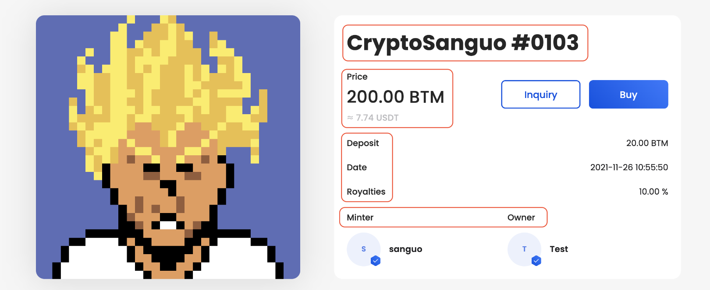

At the bottom of the NFT, users can view each transaction history and inquiry history, and click the link to enter the expolrer to view the status of this record.

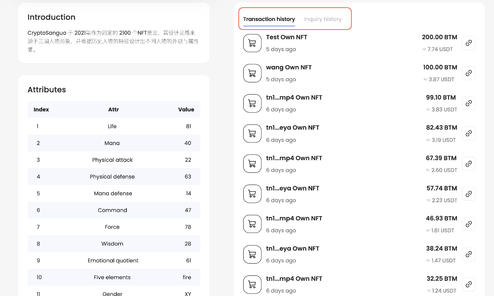

### 6.How to buy NFTs in the Maze platform

#### 6.1 Buy

**6.1.1 Click NFT**
Click [Buy] to enter transaction page. The current price of the NFT work is displayed at the top.
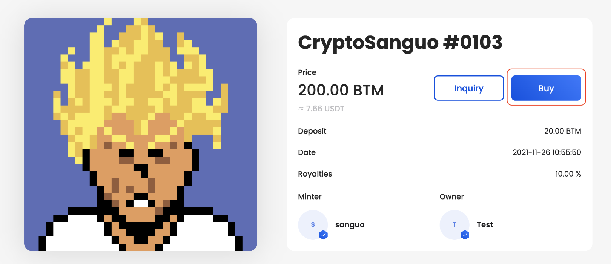

**6.1.2 Deposit margin**

According to the radical trading, the user needs to enter the margin for holding the NFT. After the enter is completed, the system will automatically calculate the total fees to be paid, the sell price and the estimated income.
The sell price of the NFT = margin x 10 
e.g. if the margin is 10 BTM, the sell price will be 10x10=100 BTM.
estimated income is the income after sale, estimated income = sell price x (1 - royalty rate - gas fee rate) - purchase price.
e.g. if the purchase price is 100 BTM, the sell price is 120 BTM, and the royalty rate is 10%, then the estimated income is 120 x (1-10%-1%) - 100 = 6.8 BTM

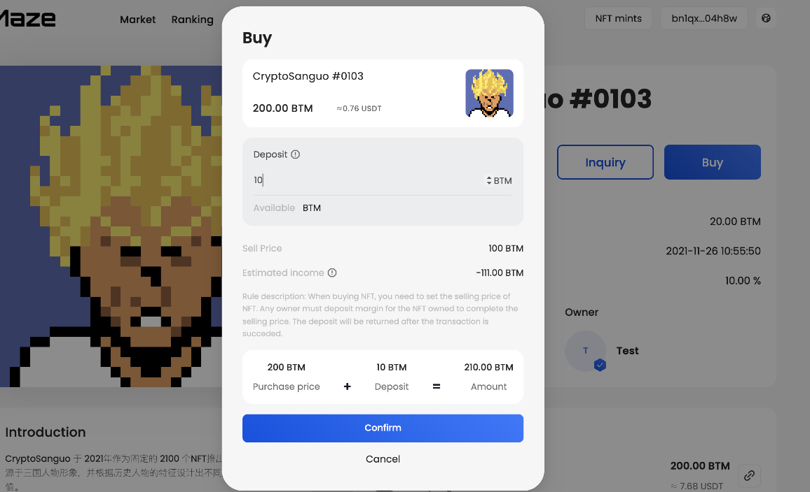

**6.1.3 Confirm price**
Click [Conform] after confirming the total cost and verify the wallet password, complete the transaction.

**6.1.4 Check NFT**
After completing the transaction, the transaction history will be left under the NFT, the information of the onwer will be changed, and owner can check NFT on profile page.

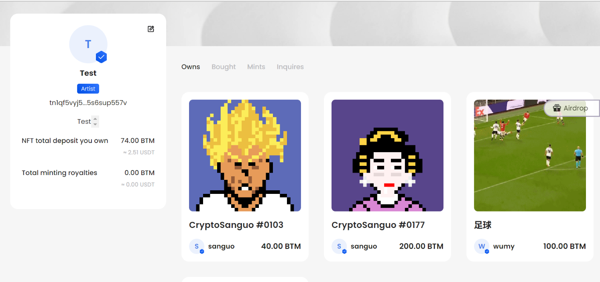

#### 6.2 Inquiry

**6.2.1 Click NFT**

Click [Inquiry] to enter inquiry transaction page. The current price of the NFT work is displayed at the top.

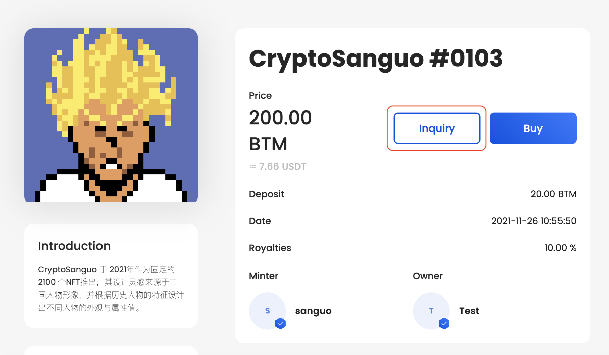

**6.2.2 Enter the inquiry price and margin**

Users need to enter the inquiry price (the price must not be higher than the current price). According to the radical trading, users need to enter the margin, the system will automatically calculate the total fees to be paid, the sell price and the estimated income.

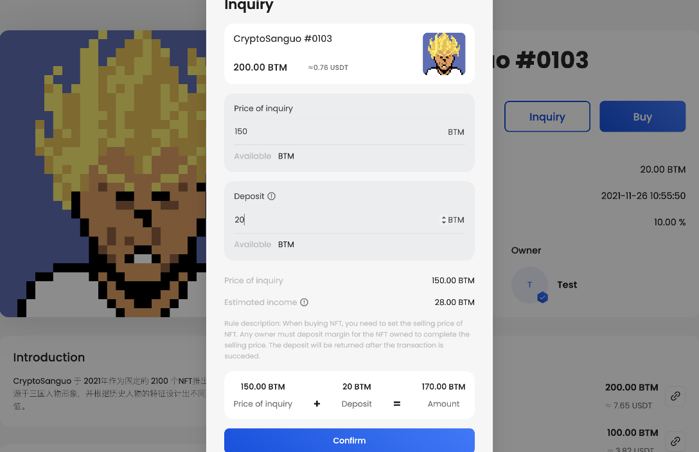

### 7. Mint NFT

#### 7.1 Enter [NFT mints] page

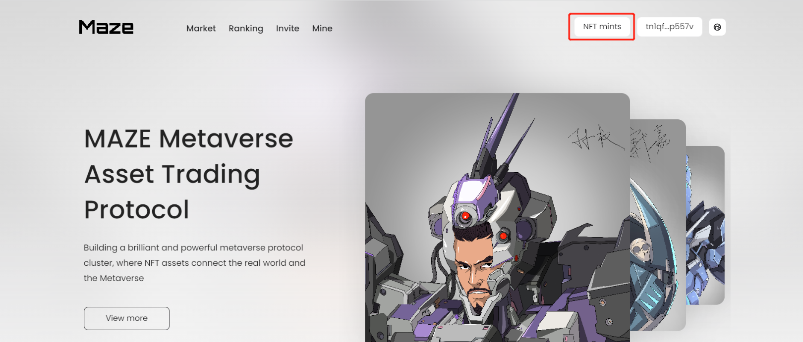
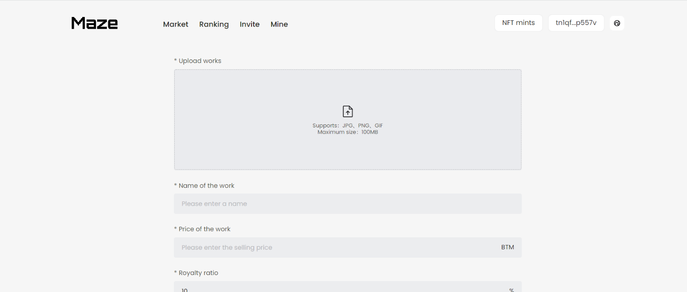

#### 7.2 Upload information

The supported upload formats are: JPG, PNG, GIF (more format types will be supported according to the product update), and the maximum file size supports 100MB.
After the work is uploaded, the user fills in the name of the work, the price of the work, the royalty ratie (official recommendation: 10%, the maximum value can be set at 50%, and the artists will get the royalty income after each transaction is completed) and the description of the work in order.

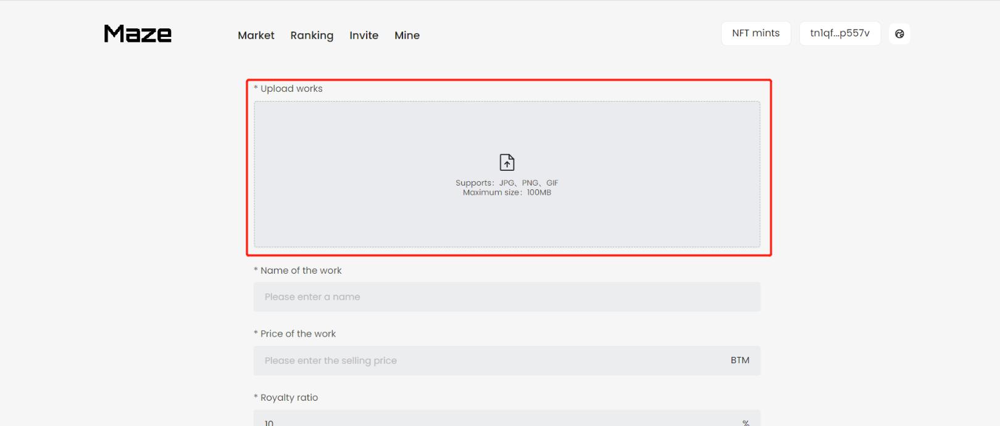

#### 7.3 Confirm

Click the [Confirm] after filling out the form, verify the signature by entering the wallet password, and complete the NFT minting.

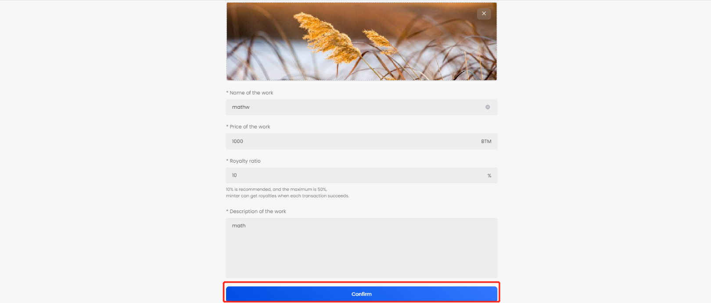

Minting success, enter the transaction page

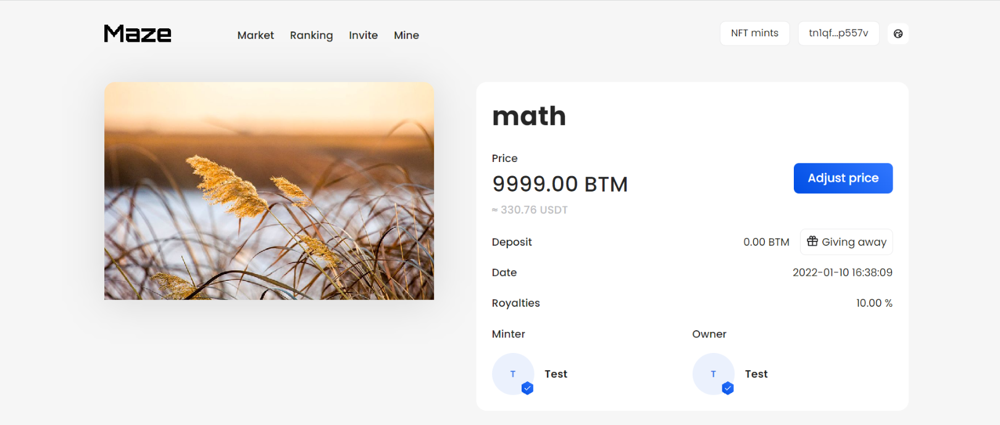

#### 7.4 Modify sell price

Artist can modify sell price on the detail page

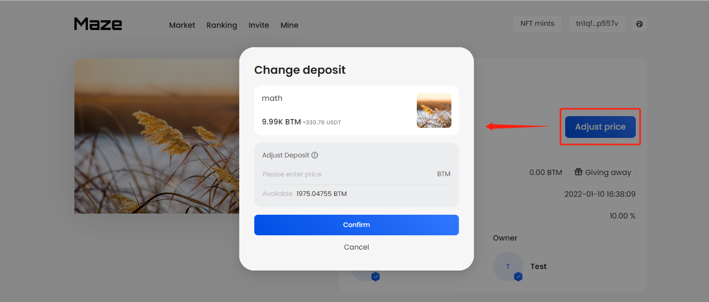

### 8. Ranking

#### Enter the ranking page

Click [Ranking] in the navigation bar to enter the ranking page

After entering the ranking page, the page shows  [Artist Ranking] page by default, users can manually switch to view the [last 7 days transaction] and [want to purchase] page

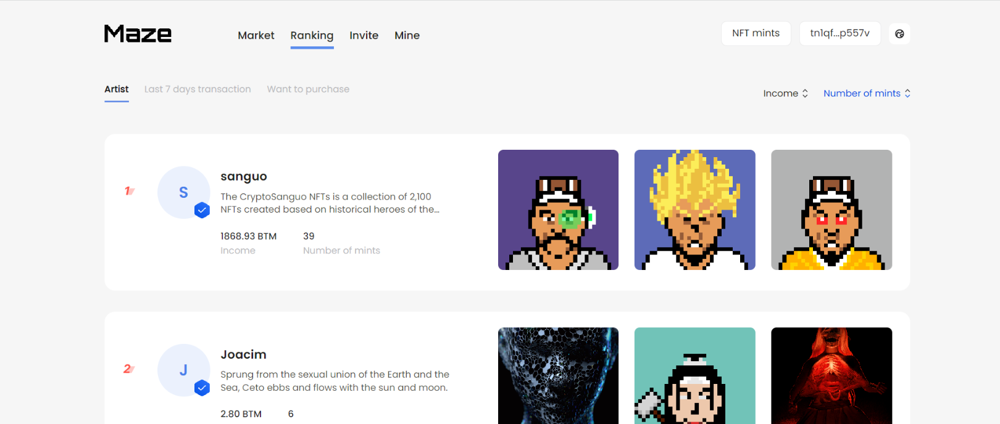