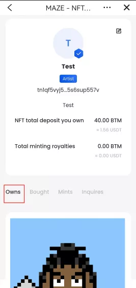

## CryptoSanguo NFT Migration Instructions on Maze World 2.0

Users can manually migrate the CryptoSanguo NFT in their accounts to the BMC chain after Maze World 2.0 goes online. Other NFTs will gradually open the migration function.
Website：https://v2.maze.market/
The migration steps are as follows:

### 1.Download and open the latest version of Bycoin

Bycoin Website ：https://blockmeta.com/wallet/
IOS：https://weibo.com/7610621226/KgbOSlNmn

### 2.Check the NFT in your account

Switch to the Bytom main chain, click the [Maze] to enter the Maze World 1.0, and enter [Mine] to view the CryptoSanguo NFT held by the current account.

### 3.Migrate

Click on the CryptoSanguo NFT you hold to enter the details page, and click the [Migrate] button on the right side of the deposit to enter the NFT migration page.

### 4.Comfirm migrate

On the NFT migration page, enter your own BMC address and confirm the migration.

The NFT and the deposit of the NFT will be migrated within 24 working days after submitting the migration operation.

### 5.Check your NFT in BMC chain

Users can view the CryptoSanguo NFT that has been migrated by themselves on the BMC chain.

