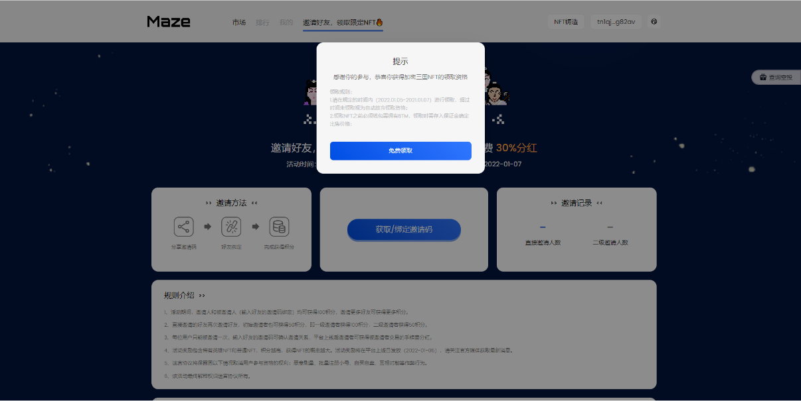

## 预注册活动加密三国NFT领取流程

### 移动端

1. 前往领取页面

进入Bycoin，在Bytom主网络下进入Maze协议，点击导航栏中的【邀请好友，领取限定NFT】进入领取页面。

2. 验证领取资格

点击页面中右侧的【查询空投】，验证签名与钱包密码后，将会自动提示该钱包是否拥有领取NFT资格。

3. 领取NFT

拥有活动NFT领取资格，点击【免费领取】按钮，进入领取状态，系统将会随机为用户随机匹配一份NFT供用户领取。页面中将会显示目前该NFT的名称、参考价格（首位领取的用户暂无参考价格显示）与剩余领取时间，用户需在剩余领取时间之前完成领取NFT操作，超过时间未领取，将被视为自动放弃领取资格。

4. 设置出售价格

根据激进交易模式，用户在领取NFT时，用户在Bycoin钱包内需拥有BTM，用来存入保证金来设定NFT的出售价格（出售价格=保证金数量x10）。用户在页面输入想要存放的保证金数量后，点击【确认】验证签名后，成功领取NFT至钱包地址。

5. 完成领取

确完成领取后，用户将不可以在领取页面再次领取，用户可以在【我的】界面中的【当前拥有】进行查看已领取的NFT。

### WEB版

1. 前往领取页面

在PC端访问：[https://maz.network/invite](https://maz.network/invite)  进入领取页面。点击连接钱包，连接Byone钱包。

2. 验证领取资格

连接完成Byone钱包后，点击页面中右侧的【查询空投】，验证签名与钱包密码后，将会自动提示该钱包是否拥有领取NFT资格。

3. 领取NFT

拥有活动NFT领取资格，点击【免费领取】按钮，进入领取状态，系统将会随机为用户随机匹配一份NFT供用户领取。页面中将会显示目前该NFT的名称、参考价格（首位领取的用户暂无参考价格显示）与剩余领取时间，用户需在剩余领取时间之前完成领取NFT操作，超过时间未领取，将被视为自动放弃领取资格。

4. 设置出售价格

根据激进交易模式，用户在领取NFT时，用户在Bycoin钱包内需拥有BTM，用来存入保证金来设定NFT的出售价格（出售价格=保证金数量x10）。用户在页面输入想要存放的保证金数量后，点击【确认】验证签名后，成功领取NFT至钱包地址。

5. 完成领取

确完成领取后，用户将不可以在领取页面再次领取，用户可以在【我的】界面中的【当前拥有】进行查看已领取的NFT。

