## BMC超导交易指南（移动端）

### 1.下载更新到最新版Bycoin

通过[https://blockmeta.com/wallet](https://blockmeta.com/wallet)，下载更新到 Bycoin 2.9.0

### 2. 生成BMC钱包

更新Bycoin完毕后，进入主界面，点击右上角进行网络切换

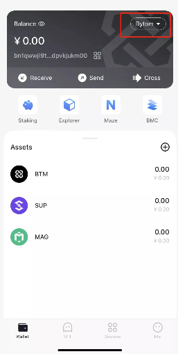

选择BMC网络

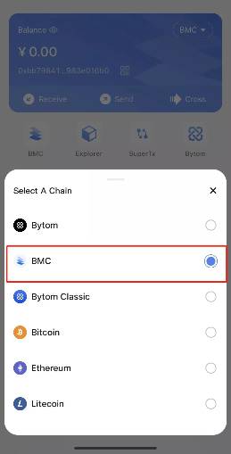

进入BMC网络，创建BMC钱包

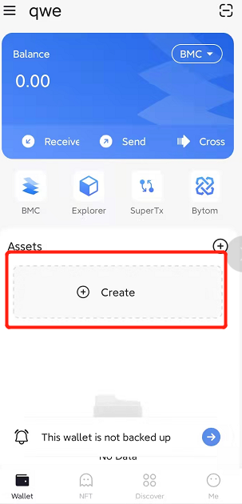

输入钱包密码，创建成功

### 3. 进入超导兑换

点击“超导兑换” 

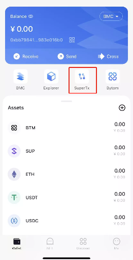

进入超导兑换主页面

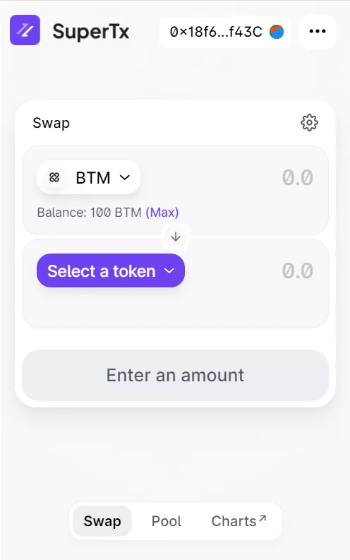

### 4.超导兑换

选择兑换的交易对，已BTM-USDT为例，输入兑换的数量

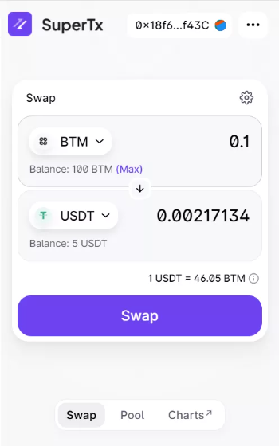

点击Swap，确认兑换

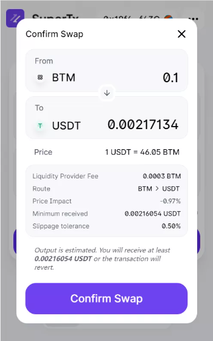

钱包输入密码，确认交易

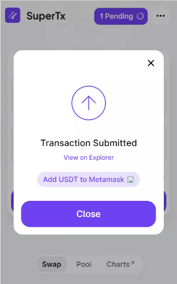

兑换成功

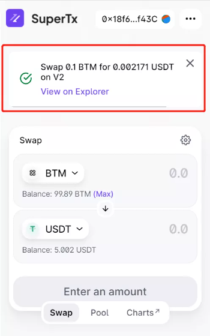

### 5. 创建或添加超导池

用户可以将资产添加入超导池，赚取手续费收入

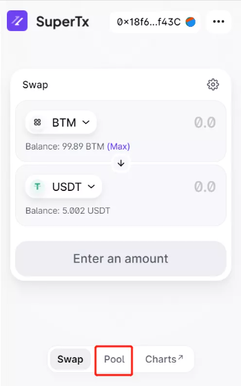

在主页面选择Pool，进入流动性池页面

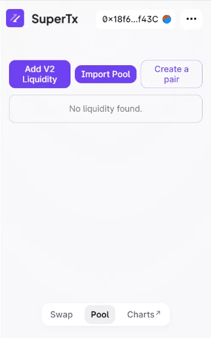

点击添加流动性， 或者点击创建一个交易对

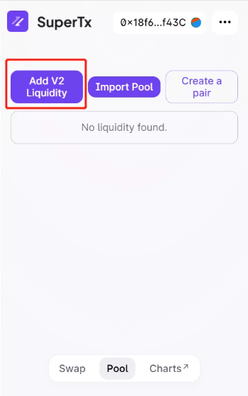

如果池子已经存在，则可以直接添加一种资产即可

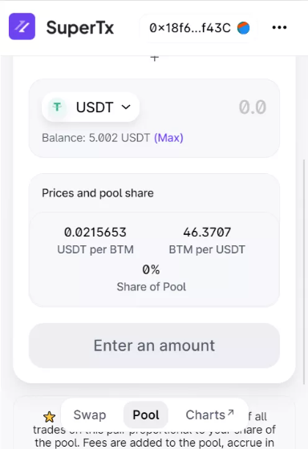

如果池子不存在，则需要设置添加的两种资产

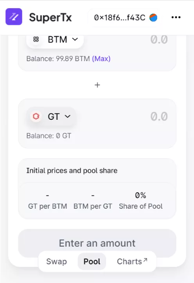

同意资产的合约调用

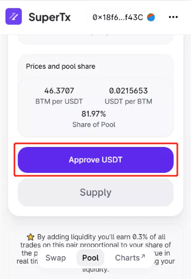

确认存入资产

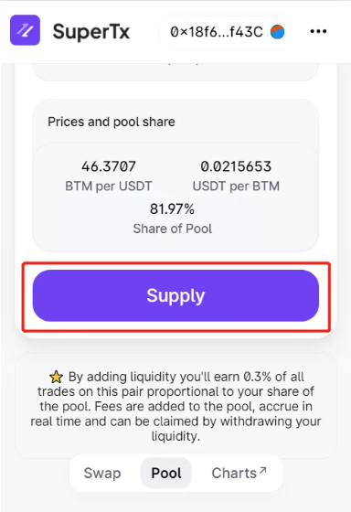

存入成功，获得凭证

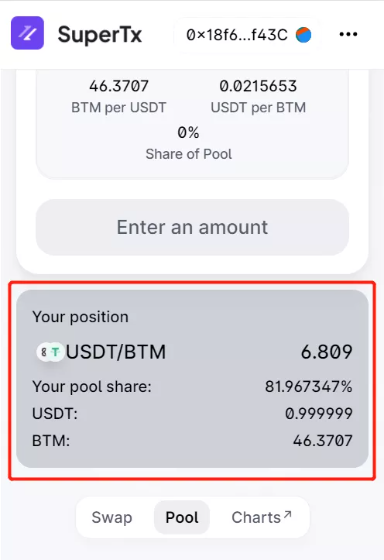

