## BMC超导流动性挖矿教程

BMC流动性挖矿为期一个月，请注意时效性

### 1. 准备工作

通过https://blockmeta.com/wallet，下载更新到 Bycoin 2.9.0，生成BMC钱包

准备BTM，BTMC或者SUP资产

### 2. 添加超导池

点击进入“超导兑换”页面

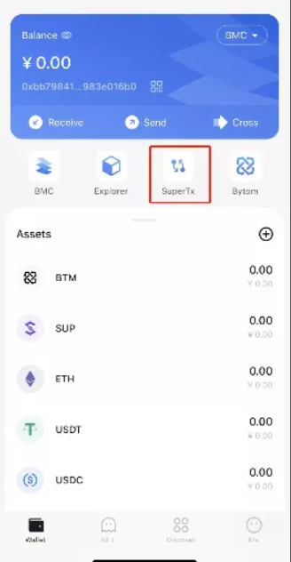

进入超导兑换主页面

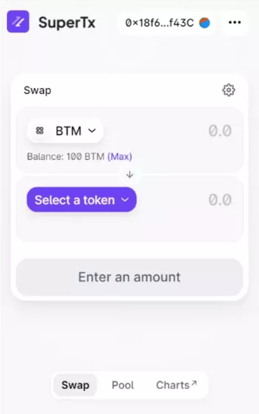

选择“Pool”，进入超导池页面

点击添加流动性

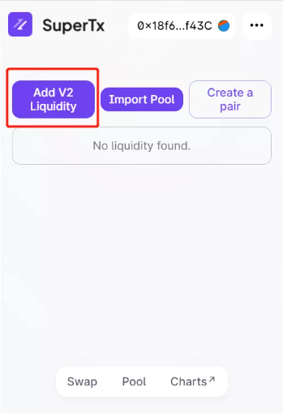

选择 BTM-SUP 或者 BTM-BMTC交易对

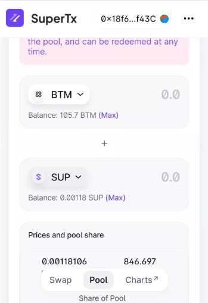

输入要添加的数量

同意SUP合约调用，输入钱包密码，等待确认

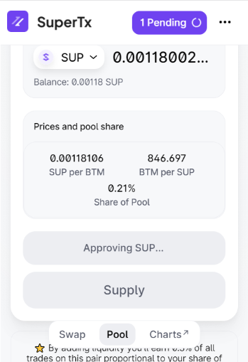

点击 “Supply”提供流动性，输入钱包密码，等待确认

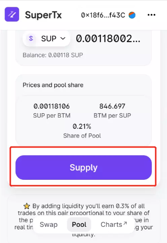

添加成功，可以看到流动性信息

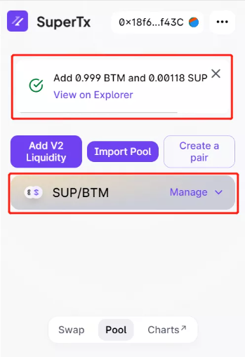

**添加成功后，即可等待收益发放**

### 3、查看超导池资产信息

点击“Charts”可以查看超导池信息，或者访问：https://info.sup.finance/home

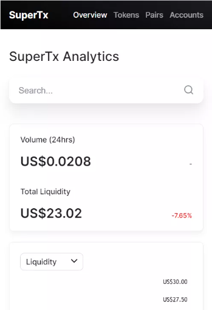

选择“Pair”，查看交易池信息

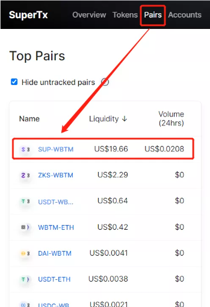

可以查看交易对价格 和 池子资产总价值

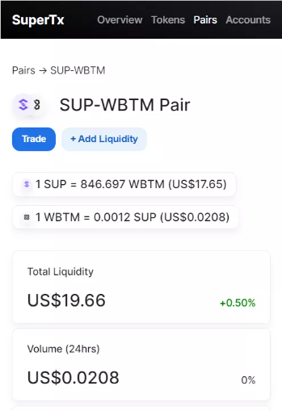

点击“Account”，搜索自己的地址

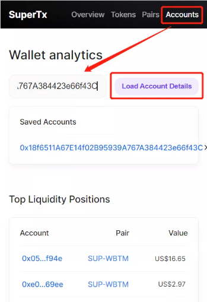

查看地址的信息

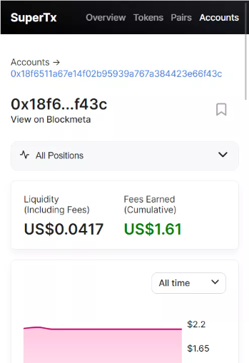

根据个人资产价值 和 池子总值，可以估算大概的收益情况。