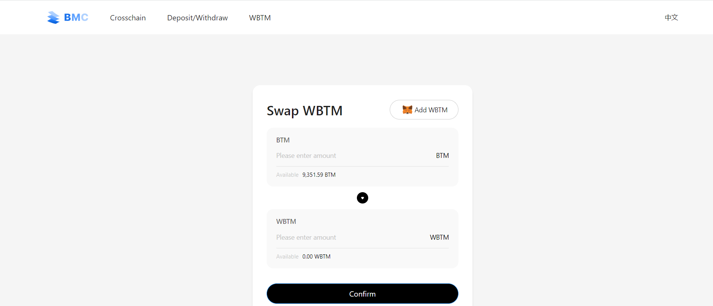
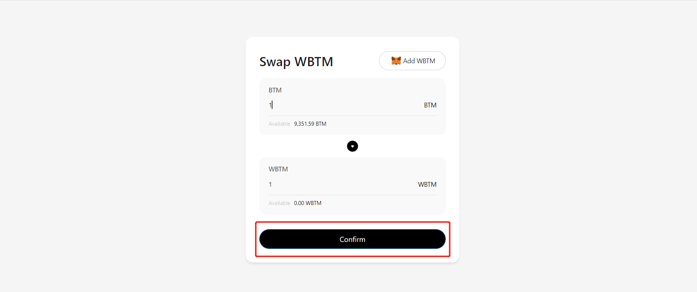
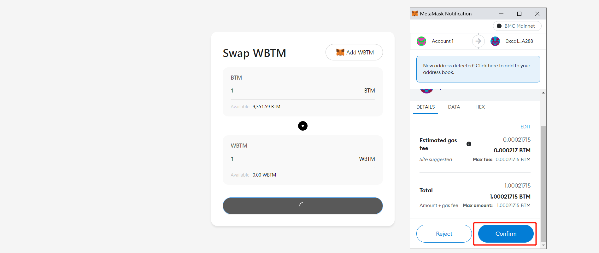

## WBTM：概念和使用

### 摘要

WBTM（Wrap BTM）是在BMC链（Bytom Sidechain）上和BTM 1：1等价的BAP20代币，BTM是BMC的原生代币，可以支付网络燃料费，但其不能方便的被合约调用，无法在Dapp（去中心化应用）广泛使用，所以需要WBTM发挥其作用。

WBTM可以和BTM进行1：1兑换，可以在https://wbtm.bytom.io/进行一键兑换

### 什么是WBTM

WBTM（Wrap BTM）是在BMC链（Bytom Sidechain）上和BTM 1：1等价的BAP20代币，WBTM不能支付网络燃料费，但其可以直接和智能合约进行交互，可以在各类Dapp中被使用，具有更大的泛用性

### 为什么需要WBTM

BMC（Bytom Sidechain）是兼容EVM的一条公链，其具有非常强大的智能合约功能，但BTM作为链原生代币，无法和智能合约进行直接交互（需要转账），那么需要一种BAP20格式的代币来承担这个功能，WBTM就应运而生。

比如，在Maze协议中，NFT需要在合约中添加保证金来定价，这就无法使用BTM来完成，需要转换成WBTM后实现设置保证金功能。

### 如何获取WBTM

WBTM可以和BTM进行1：1兑换

访问https://wbtm.bytom.io/

输入要兑换的数量

钱包确认

兑换完成，可以选择 add WBTM 讲WBTM添加到钱包中