## BMC超导交易指南（Web端）

### 1. 准备Metamask钱包

https://metamask.io/ 下载安装

### 2. 切换BMC网络

可以手动添加BMC网络

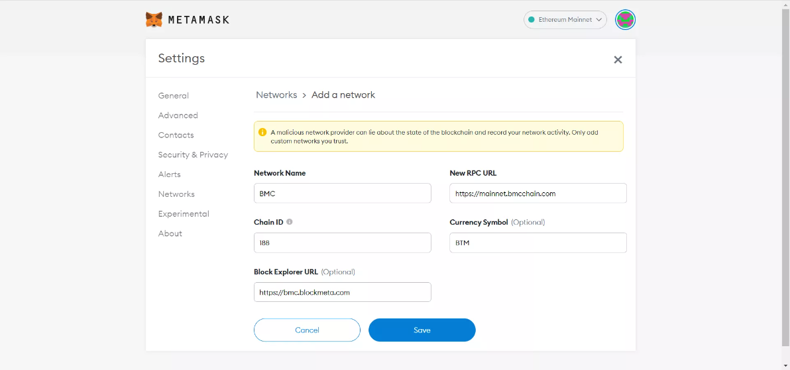

网络信息：

- NetWork Name: BMC
- RPC URL: https://mainnet.bmcchain.com
- Chain ID: 188
- Currency Symbol: BTM
- Block Explorer URL: https://bmc.blockmeta.com/

也可以使用Chainlist来一键添加

点击进入 https://chainlist.org/，连接钱包

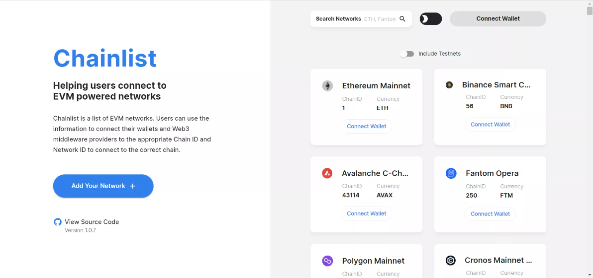

搜索BMC

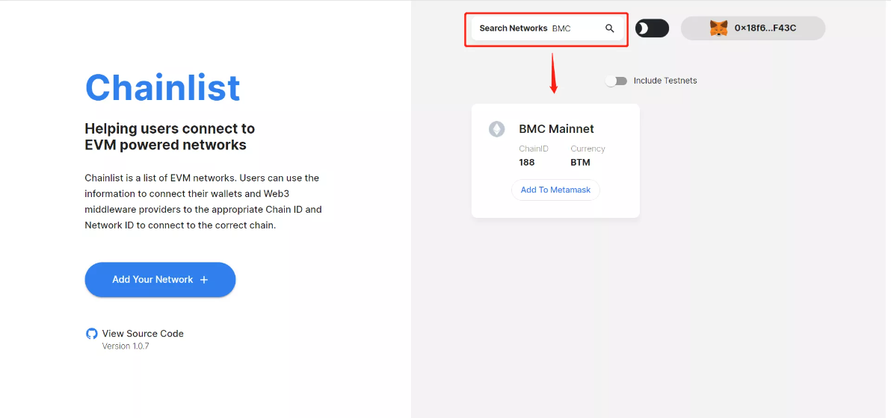

点击加入Metamask即可

### 3. 进入超导兑换

在浏览器中输入网址 https://sup.finance/#/swap，进入超导兑换页面

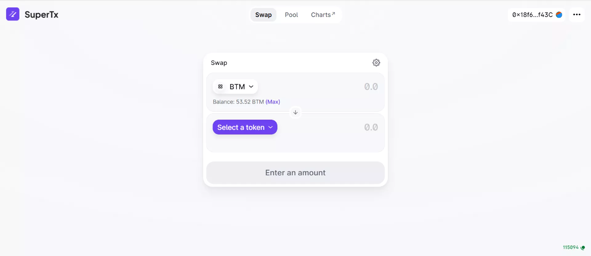

### 4. 超导兑换

选择兑换的交易对，以BTM-USDT为例，输入兑换的数量

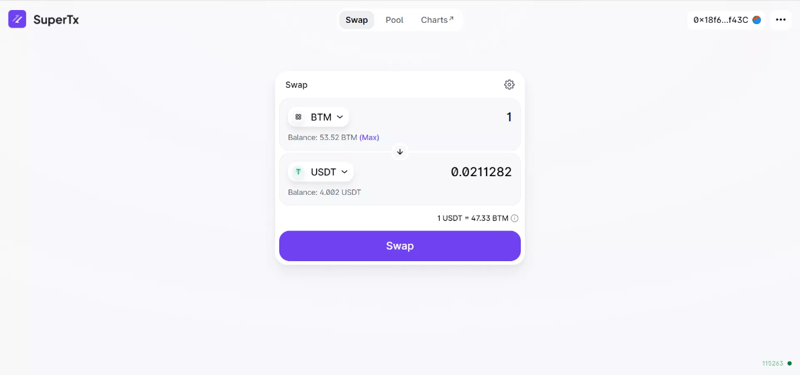

点击Swap，确认兑换

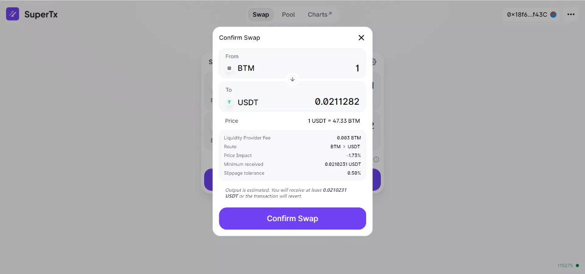

点击Metamask确认兑换

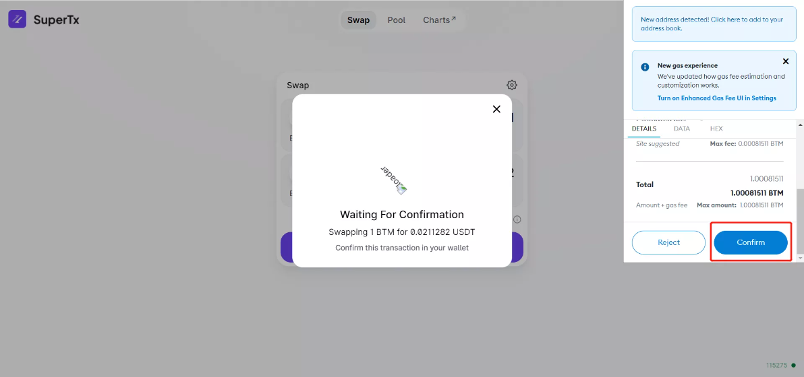

兑换成功

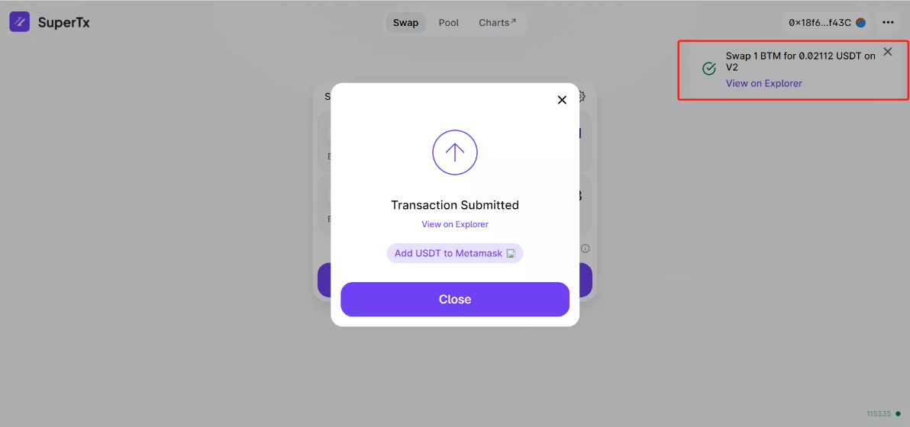

### 5. 创建或添加超导池

选择Pool 进入超导池

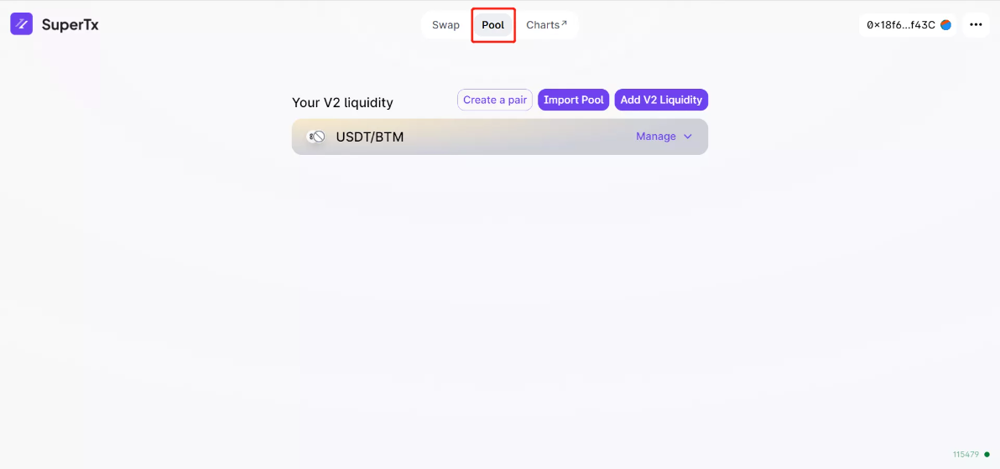

点击添加交易对，或者添加流动性

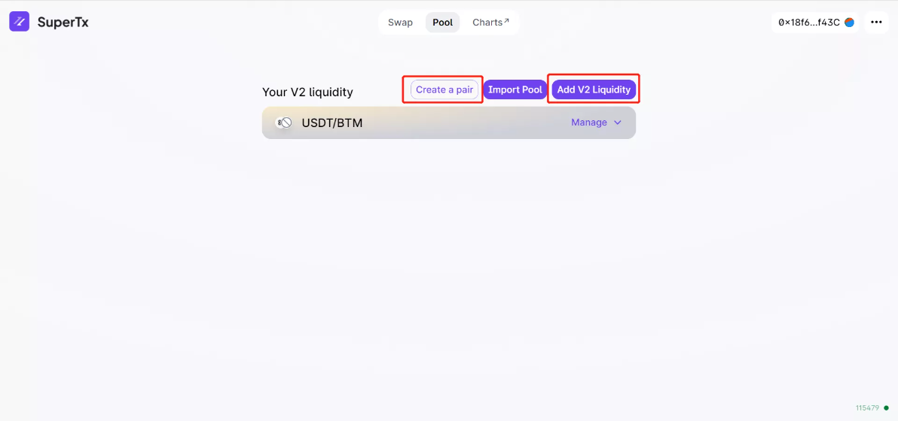

选择需要添加的币种和数量，点击存入超导池

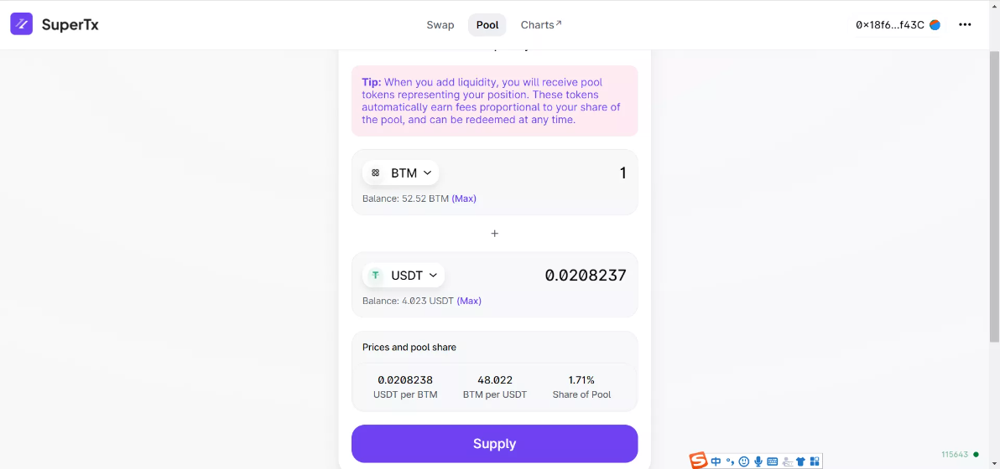

确认存入

在metamask钱包确认交易

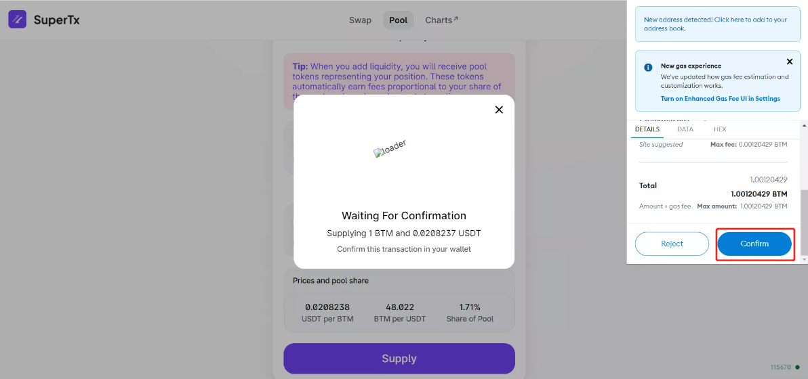

存入成功

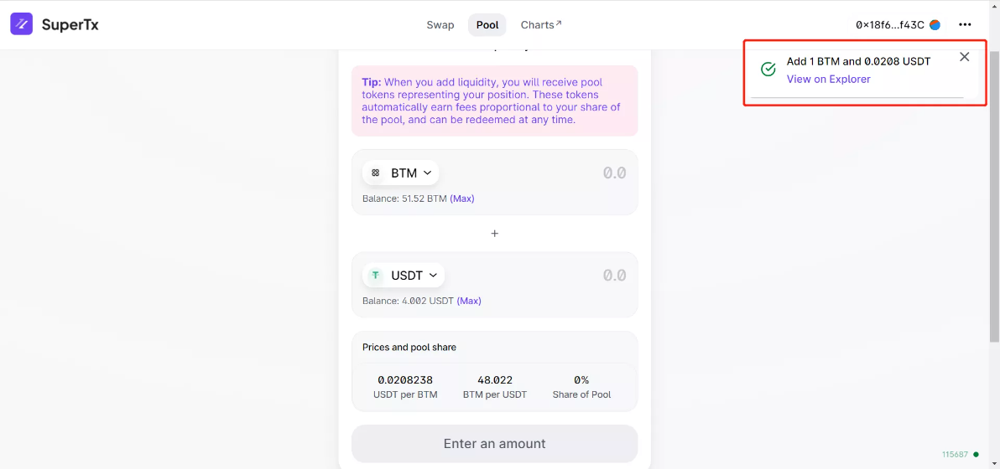