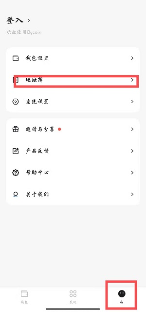
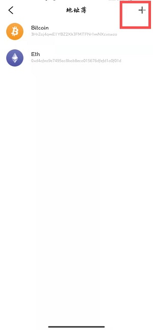
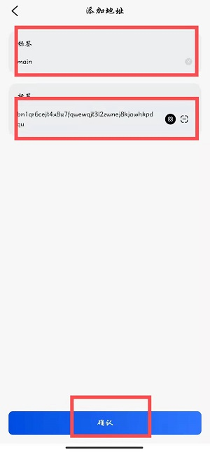
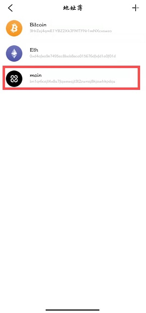
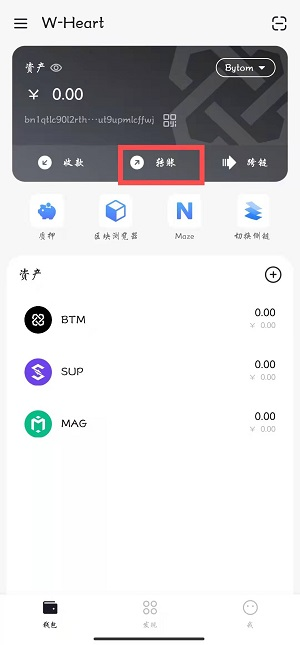
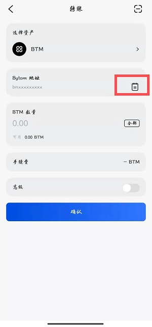
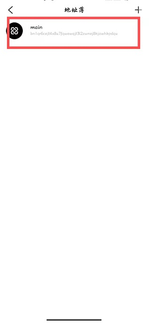
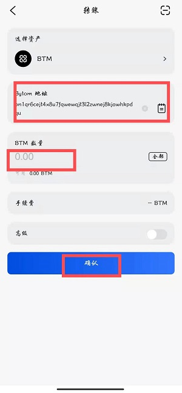

## 地址簿功能使用说明

如果我们有几个常用转账地址，每次粘贴输入会很麻烦， **地址簿** 功能恰好可以解决这个问题。

### 1.添加地址

打开Bycoin选择右下角 **我** 选项，选择 **地址簿** 功能，点击进入。

点击右上角 **+**，进入 **添加地址** 页面。

输入地址标签以及地址，点击 **确认**。

你会看到地址簿里已经显示了你刚添加的地址。

### 2. 使用地址簿

当我们需要转账时，点击 **钱包** 选择 **转账** 功能。

点击地址簿小图标使用地址簿功能。

选择你要转账的地址。

输入转账金额点击确认输入密码即完成转账。

