## BMC跨链教程

### Bytom -> BMC

打开Bycoin（要求2.9.0以上），确认此时处在Bytom网络下，点击跨链。

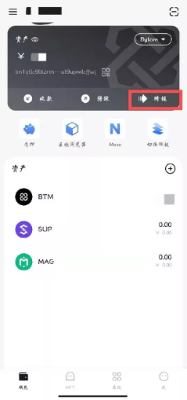

确认跨链资产种类，选择正确的跨入跨出链，输入跨链额度，这里我们输入10，点击提交。

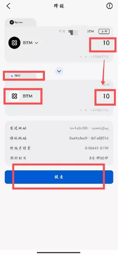

确认发送地址、接收地址与转账金额，确认无误请点击确认，输入密码，弹出请求成功提交界面，点击完成，等待几分钟的确认时间，跨链即可到账。

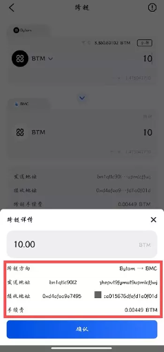

此时我们切换至BMC链，点击右上角下拉箭头选项，选择BMC。

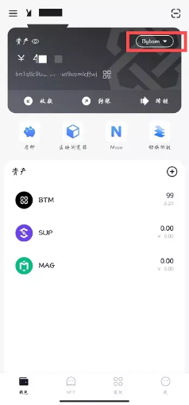
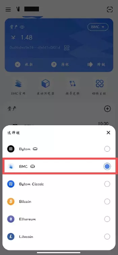

可以看到之前跨链的10个BTM已经到账户中。

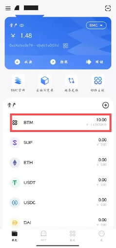

### BMC -> Bytom

在BMC网络下，点击跨链

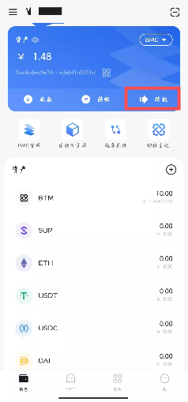

确认币种、链和地址后，输入金额9，点击提交

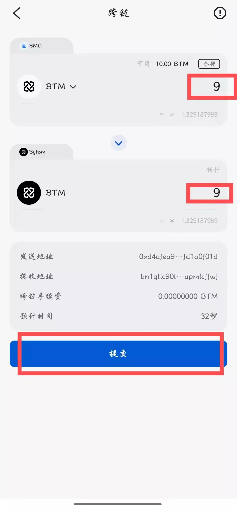

再次确认信息，无误后点击确认，输入密码后，弹出成功请求界面，点击完成，等待几分钟即可完成跨链。

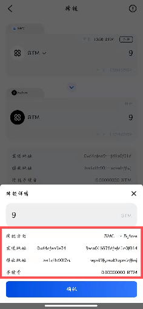
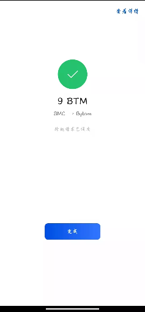

此时我们切换回Bytom，可以看到资产已经增加。我们可以点击资产（BTM），选择跨链，即可看到我们两次的跨链操作。

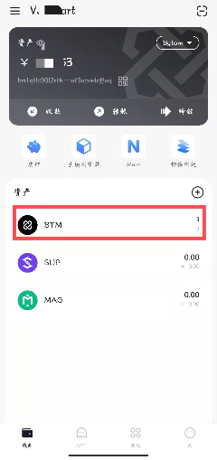
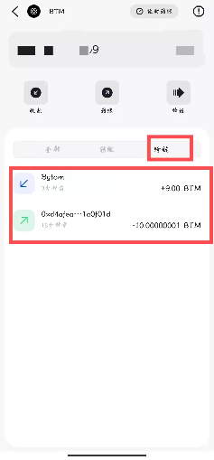

