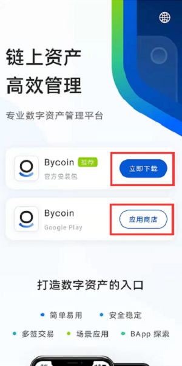
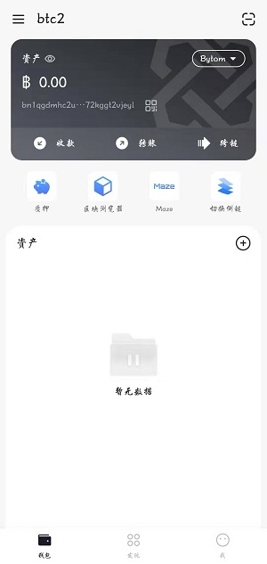
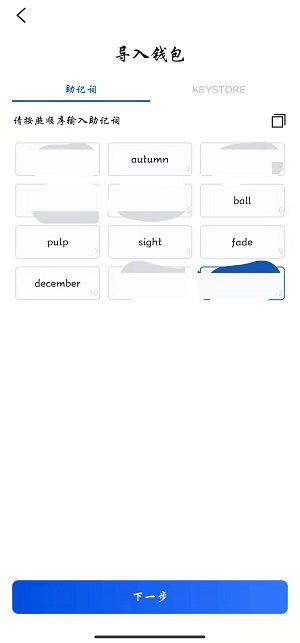
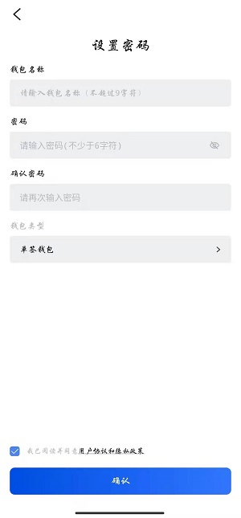

### 1.安装Bycoin

**1.1 安卓设备用户**

访问Bycoin钱包官网：[https://blockmeta.com/wallet/](https://blockmeta.com/wallet/) 点击【立即下载】或者【谷歌应用商店下载】

**1.2 IOS设备用户**

请准备海外appleID访问AppStore或者TestFlight安装Bycoin

查看注册海外ID教程：[https://support.maz.network/zh/bycoin/Overseas-ID-registration-tutorial.html](https://support.maz.network/zh/bycoin/Overseas-ID-registration-tutorial.html)

查看IOS设备用户下载教学视频：[https://weibo.com/7610621226/KgbOSlNmn](https://weibo.com/7610621226/KgbOSlNmn)

### 2.创建钱包

**2.1 创建钱包**

点击创建钱包

**2.2 输入新建钱包信息**

输入新建钱包确认密码，再次输入确认密码

**2.3 备份助记词**

请牢记助记词，如有丢失，则该钱包里面的资产将无法找回

**2.4 验证助记词**

成功备份、验证助记词后，创建成功

**2.5 创建成功**

成功备份、验证助记词后，进入Bycoin首页

### **3.导入钱包**

**3.1选择导入钱包**

**3.2选择导入钱包方式**

可通过助记词或者KEYSTORE进行导入钱包

**3.3 输入助记词导入钱包（推荐）**

按照备份顺序输入助记词

**3.4 设置钱包名称和密码**

助记词识别正确后，设置导入钱包名称和确认密码 

**3.5 导入成功**

钱包导入成功后，进入Bycoin首页

