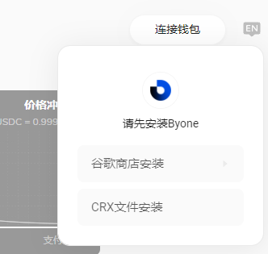

## MOV Web连接Byone钱包

### 1、安装Byone
如供您的设备上未安装谷歌插件钱包——Byone，您将无法使用MOV-web下的相关服务。

点击进入网址：https://supertx.bymov.io/swap#
点击右上角“连接钱包”

#### 1.1、从谷歌商店安装（推荐方式）

选择“谷歌商店安装”，访问页面

点击“添加至Chome”，并从弹窗页面选择添加扩展程序

安装将会自动进行，安装完成后您可以在插件栏找到您的Byone，并通过锁定按钮将其锁定在工具栏

#### 1.2、通过离线安装包安装

鼠标悬停至“CRX文件安装”，点击“下载”，将文件名为"byone.crx"的离线安装包下载至本地。 

点击谷歌浏览器有上角设置按钮，依次选择更多工具——扩展程序，进入插件管理页面

打开右上角的“开发者模式”，将刚下载好的离线安装包拖拽至扩展程序栏，浏览器将识别文件并自动安装

加载成功后即完成安装

### 2、创建新钱包

点击Byone插件，首次访问将会弹出页面提示您创建新钱包，或导入您已有的钱包

请按流程创建钱包。（设置钱包名称、密码——备份助记词——验证助记词）

务必请您保存好生成的助记词，这是您恢复钱包的唯一途径。一旦助记词丢失您钱包内的数字资产将无法找回。

创建成功后，即可使用您的Byone

### 3、导入钱包

选择导入钱包，您可通过助记词、keystore、keystore纯文本三种方式导入(推荐助记词导入)

请依次按顺序输入您的助记词，用空格隔开

助记词识别正确后，请您设置钱包名称和密码

导入成功

### 4、访问MOV-web并连接Byone

安装完成后，首次访问MOV-web需要先连接Byone，才可正常使用相关功能

首先将Byone切换到侧链，点击顶部下拉箭头

选择侧链 Sidechain

点击连接Byone

连接成功后，页面已显示您的钱包连接状态信息

接下来您已经可以使用MOV-web的相关功能了！
