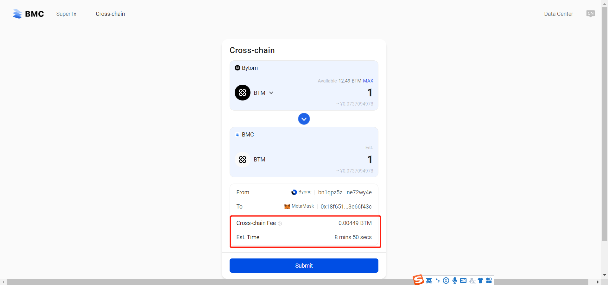

## Web跨链教程

打开链接：https://bmcbridge.bytom.io/cross-chain

目前MOV-web可以连接MetaMask和Byone，支持ETH->BMC, Bytom->BMC,BMC->ETH,BMC->Bytom

### 连接钱包

在使用跨链之前，请先安装MetaMask以及Byone的谷歌插件，并及时备份。

在跨链页面下，点击钱包icon下的连接按钮，分别唤起授权提示进行连接。

Byone授权连接：

MetaMask授权连接：

### BMC->ETH跨链

以跨链USDT为例

选择BMC网络，并选择USDT币种

输入需要跨链的USDT数量
注意手续费，如果手续费不足，则不允许跨链

点击提交，并在Metamask中确认

交易确认成功，开始跨链

等待到账

## Bytom->BMC跨链

以跨链BTM为例

选择BMC网络，并选择BTM币种

输入需要跨链的BTM数量
注意手续费，如果手续费不足，则不允许跨链

点击提交，在Byone中确认签名

提交成功

等待到账