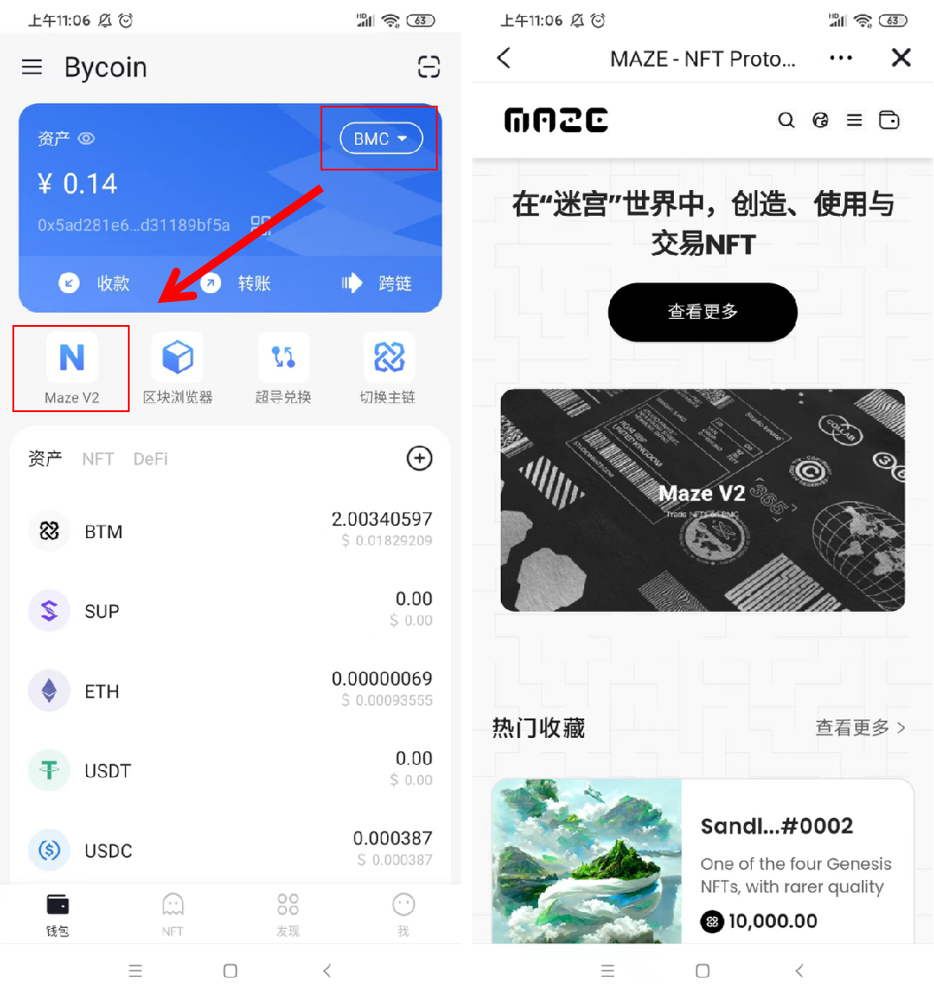
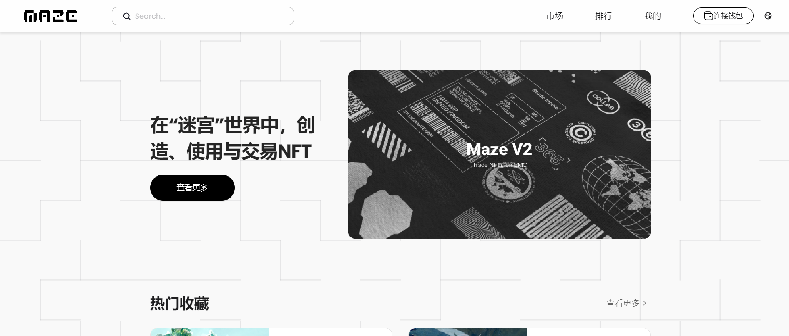
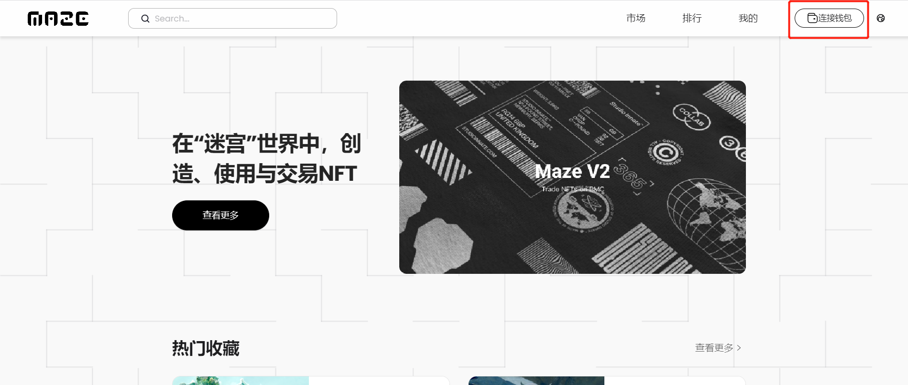
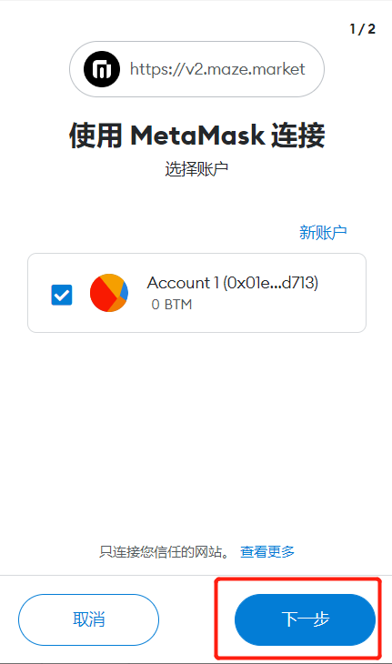
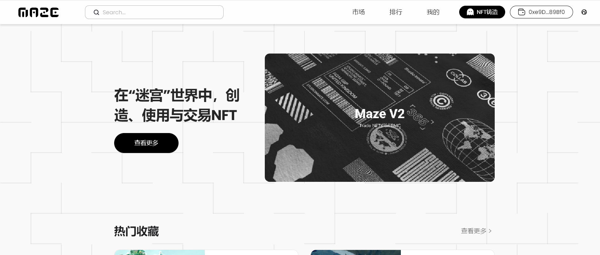
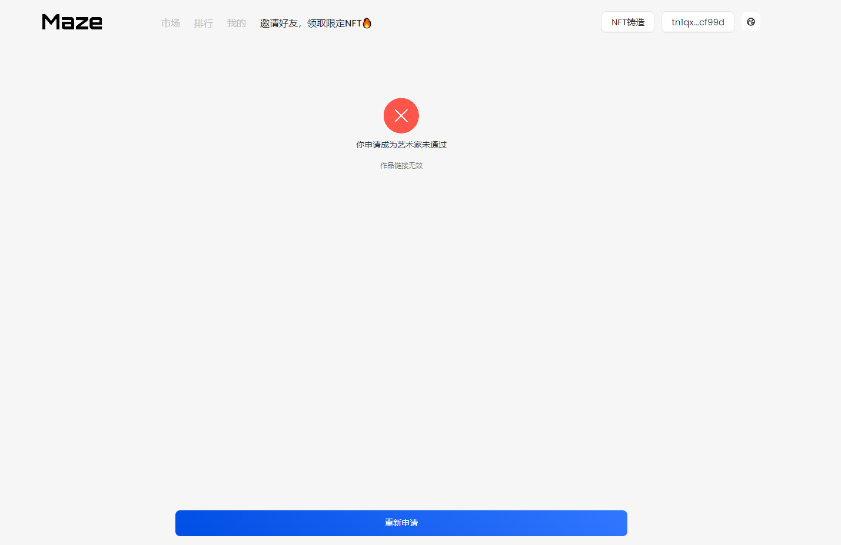

## 比原链迷宫协议艺术家申请流程

### 一、移动端

#### 1.1 进入移动端【迷宫协议】

在Bycoin的BMC网络状态下，点击MAZ图标进入【迷宫协议】

#### 1.2 申请迷宫协议艺术家

**1.2.1 申请艺术家入口**

进入【迷宫协议】页面后，移动页面至最下方，点击申请成为艺术家

**1.2.2 进入申请页面填写资料**

进入申请页面后，按照显示内容填写申请艺术家资料

**1.2.3 提交资料**

填写完成后，点击提交按钮，进入审核状态

**1.2.4 审核结果**

官方将在五个工作日内给予用户回复，通过审核后用户可前往【NFT铸造】页面，未通过审核可在页面中进行重新申请。

#### 1.3 申请迷宫协议艺术家

通过审核成为艺术家的用户，可以在点击导航栏进入【我的】界面，查看艺术家认证状态、修改名称与简介。

### 二、Web端

#### 2.1.进入Web端【迷宫协议】

在浏览器中输入Web端迷宫协议访问网站：https://v2.maze.market/

#### 2.2.申请迷宫协议艺术家

**2.2.1 连接钱包**

在迷宫协议页面连接Byone钱包

提示应用授权，点击连接，在连接完成后，迷宫页面显示Bytom主网bn开头地址

**2.2.2 申请艺术家入口**

进入【迷宫协议】页面后，移动页面至最下方，点击申请成为艺术家

**2.2.3 进入申请页面填写资料**

进入申请页面后，按照显示内容填写申请艺术家资料

**2.2.4 提交资料**

填写完成后，点击提交按钮，确认签名信息，输入钱包确认密码，进入审核状态 

**2.2.5 审核结果**

官方将在五个工作日内给予用户回复，通过审核后用户可前往【NFT铸造】页面，未通过审核可在页面中进行重新申请。

#### 2.3 成为迷宫协议艺术家

通过审核成为艺术家的用户，可以上方导航栏进入【我的】界面，查看艺术家认证状态、修改名称与简介。

