## MAZ平台移动端操作手册

### 一、进入迷宫协议

#### 1.Bycoin版本

用户需将Bycoin更新至2.8.2以上版本，才会显示迷宫协议选项。

#### 2.如何进入迷宫协议

打开Bycoin，在Bytom主链界面中，点击【Maze】，即可进入迷宫协议。

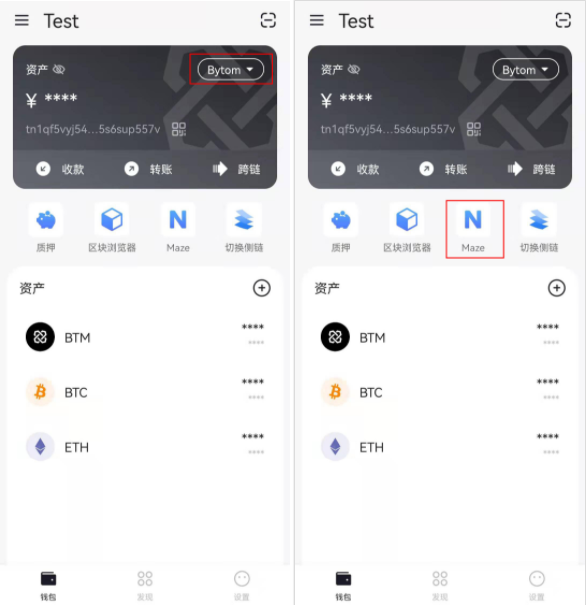

### 二、迷宫协议功能导航

在进入迷宫协议后，可以点击右上角导航栏，跳转至迷宫协议的功能页面，目前Maze协议导航栏可以跳转至【NFT铸造】、【市场】、【排行】、【我的】。

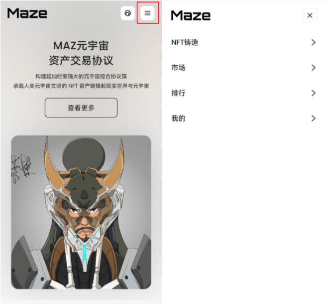

### 三、迷宫协议个人中心

#### 1. 如何进入【我的】

用户可以通过导航栏点击【我的】进入。

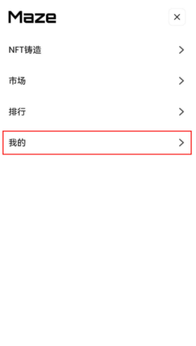

#### 2.【我的】信息

进入【我的】后，用户可以在页面中看到自己的【Bytom主链地址】、【拥有NFT总保证金】【当前拥有】、【被买走的】、【我的铸造】、【我的求购】

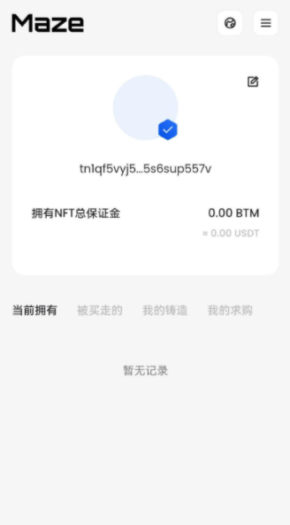

#### 3. 编辑修改个人信息

目前迷宫协议内的操作是与用户钱包的Bytom主链钱包地址所绑定，所以无法修改地址。点击编辑按钮，可以修改自己显示的名称与自我描述，在填写完成后点击确认，该操作需要确认签名，点击确认签名输入钱包密码，即可在【我的】页面显示更改后的信息。

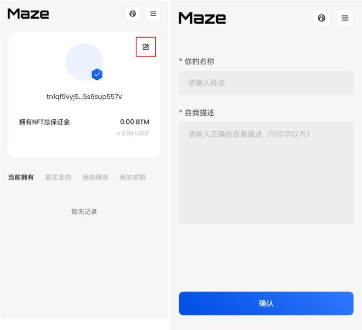

### 四、如何在迷宫协议查看NFT

#### 1.查看迷宫协议NFT

**在首页查看NFT**

在进入迷宫协议的首页，用户可以向下浏览，通过点击【热门收藏】、【热门成交】、【热门艺术家】、【稀有NFT】的 【查看更多】选项，跳转到市场/排行榜，进行选购。

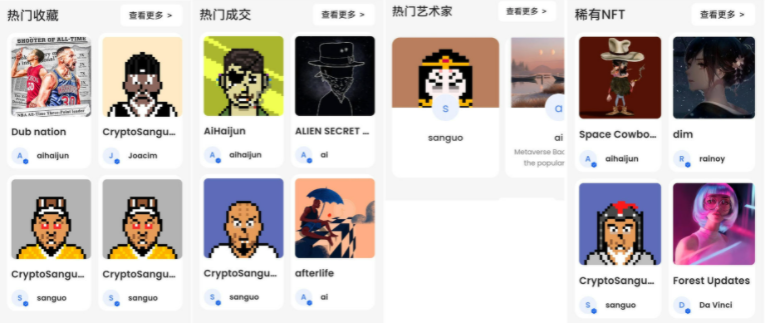

**在市场选择NFT**

通过导航栏点击【市场】，进入迷宫协议市场，用户可以根据NFT热度及加个进行升降序排序筛选作品，也可以进行NFT作品名称的关键字搜索查询。

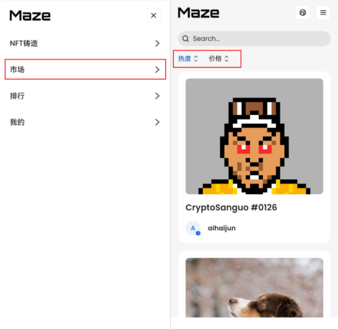

#### 2.点击NFT图像进入交易页面

进入交易页面会显示NFT的作品原件、作品名称、NFT作品描述、铸造者、当前拥有者、价格、作品保证金、铸造时间、版税信息信息。

#### 3.交易记录及求购记录

在NFT作品的下方，可以自由的查看该作品的每笔交易记录及求购记录，点击后方的链接按钮可直接跳转至区块浏览器查看该条记录的状态。

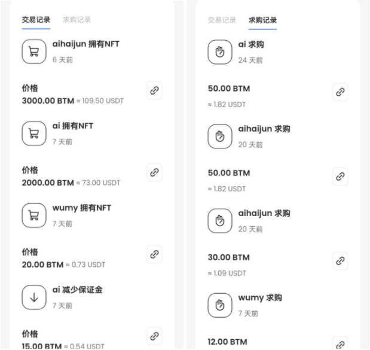
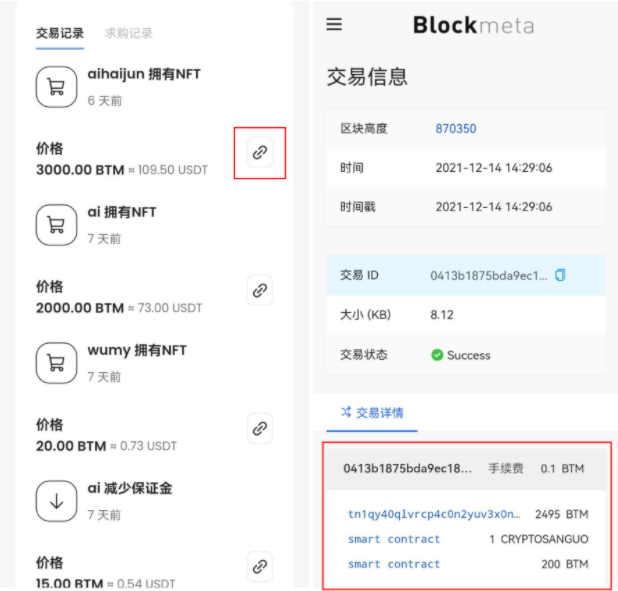

### 五、如何在迷宫协议购买NFT

#### 1.立即拥有交易

**点击NFT作品**

在选择的NFT作品下方，点击【立即拥有】按钮，进入立即拥有交易页面。最上方显示该NFT目前的作品价格。

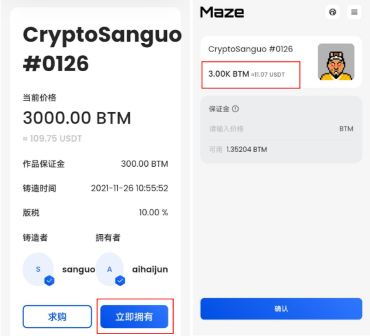

** 输入保证金**

根据激进交易模式，用户需要在下方输入持有该NFT作品保证金，在输入完成后，系统将会自动计算所要支付的合计费用、出售价格及预计收益信息。
NFT的出售价格=保证金x10  如：填写保证金为10BTM，则该NFT的售价将为10x10=100BTM。
预计收益为购买后并且成功售出的收益，预计收益=出售价格x（1-作品版税比例-平台手续费比例）-购买价格。
如：购买价格为100BTM，出售价格为120BTM，版税为10%，那么预计收益是 120 x（1-10%-1%）-100 = 6.8 BTM

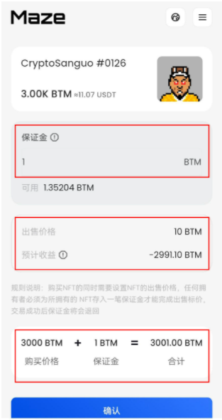

**确认价格**

确认合计费用后点击【确认】按钮，验证钱包密码，完成立即拥有交易。

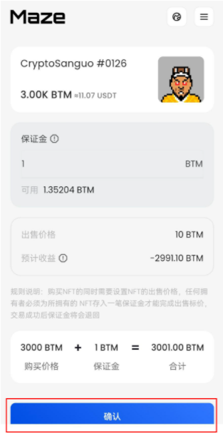

**查看交易完成拥有的NFT**

完成立即拥有交易后，会在该作品下方留下交易记录，NFT持有者进行变更，持有者可以在【我的】中【当前拥有】进行查看。

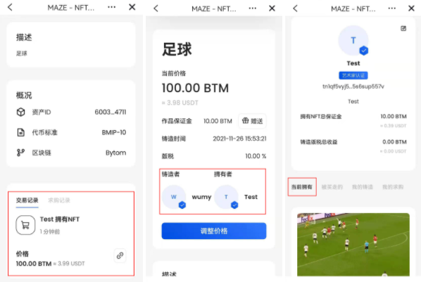

#### 2.求购交易

**点击NFT作品**

在选择的NFT作品下方，点击【求购】按钮，进入求购交易页面。最上方显示该NFT目前的作品价格。

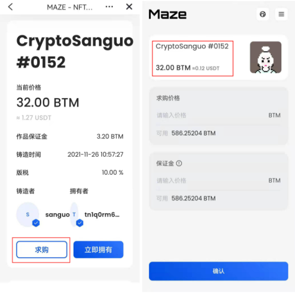

**输入求购价格及保证金**

用户需要先输入求购价格（求购价格不得高于目前价格），根据激进交易模式，用户需要在下方输入持有该NFT作品保证金，在输入完成后，系统将会自动计算所要支付的合计费用、出售价格及预计收益信息。

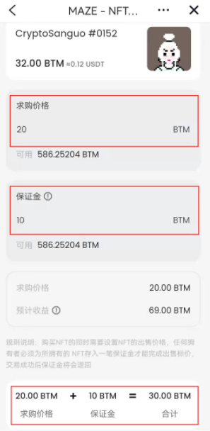

**确认价格**

确认价格后点击【确认】按钮，验证钱包密码，完成求购交易操作，等待该NFT作品持有者是否同意该出价的求购交易。

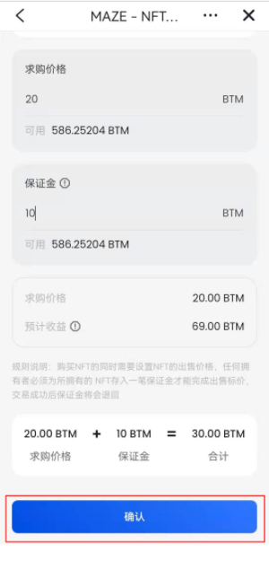

**查看交易完成拥有的NFT**

完成的求购操作可以在对应NFT作品下方的求购记录或者【我的】中的【我的求购】中进行查看。

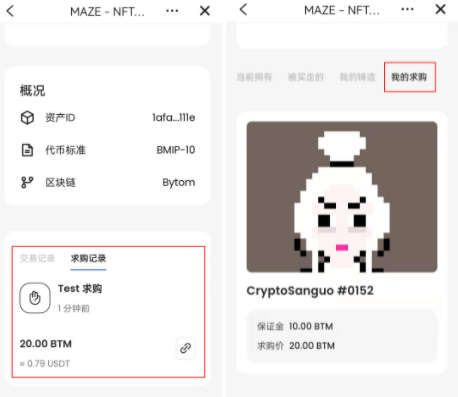

**取消求购**

用户可以在NFT详情页面进行取消求购操作，用户的出价与保证金将回返回账户地址。

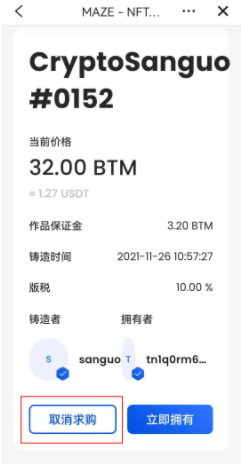

### 六、铸造NFT

#### 1.进入NFT铸造页面

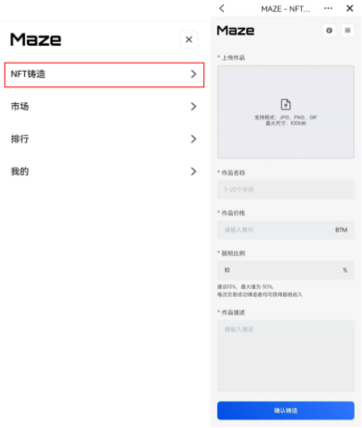

#### 2.上传文件

目前支持上传格式为：JPG、PNG、GIF（根据产品更新后续将支持更多格式类型），文件最大尺寸支持100MB。
在作品完成上传后，用户按照顺序依次填写作品名称、作品价格、版税比例（官方建议10%，最大设定值为50%，每次交易完成后铸造者均可获得版税收入）和作品描述。

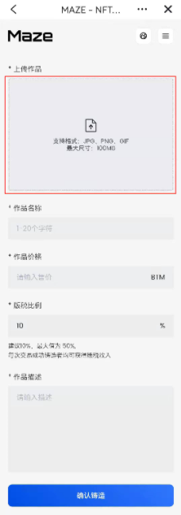

#### 3.确认铸造

填写完成后点击【确认铸造】按钮，验证签名输入钱包密码，完成NFT铸造跳转到NFT作品详情页面。

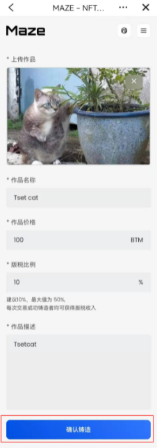

#### 4.调整价格

艺术家可以在对应NFT作品详情页面中调整价格

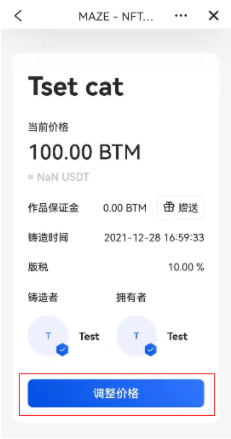

#### 5.查看铸造的NFT

完成铸造的NFT作品，可以在【我的】中【我的铸造】中进行查看

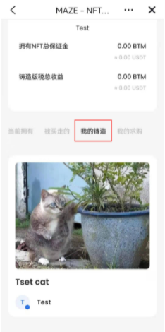

### 七、排行榜

#### 1.进入Maze协议排行榜

进入Maze协议后，点击导航栏中的【排行】进入Maze协议排行榜

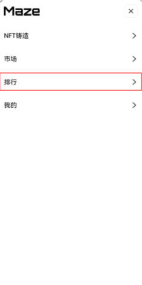

#### 2.查看Maze协议排行榜

进入排行榜页面后，页面默认显示为【艺术家排行榜】，用户可以手动切换查看【近7日热度成交NFT作品】和【热度求购NFT作品】排行榜

