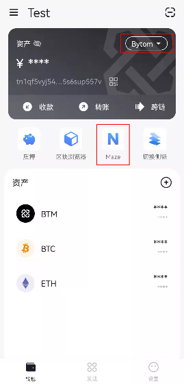
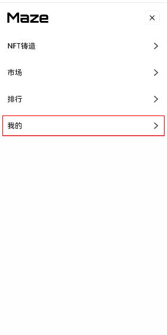
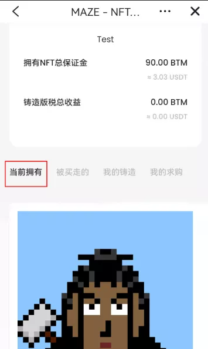
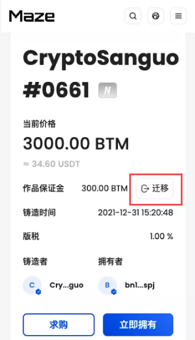
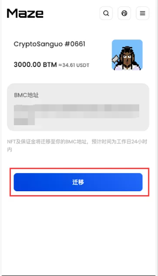
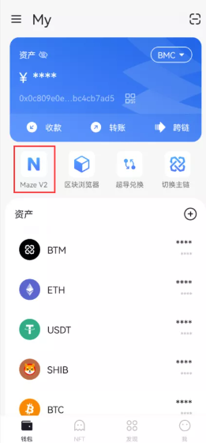
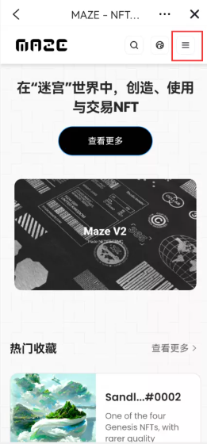

## Maze V2 CryptoSanguo NFT迁移说明

Maze V2将于2022.5.31 上线，官方网站：https://v2.maze.market/
用户可在Maze V2上线后手动迁移自己账户内CryptoSanguo NFT至BMC链中。其他NFT将会陆续开放迁移功能。迁移步骤如下：

### 1.下载并打开最新版Bycoin

Bycoin钱包官方网站：https://blockmeta.com/wallet/
IOS下载方式：https://weibo.com/7610621226/KgbOSlNmn

### 2.查看当前持有的NFT

切换至Bytom主链，点击Maze图标进入原Maze平台，进入【我的】查看当前账户持有的CryptoSanguo NFT。

### 3.开始迁移

点击持有的CryptoSanguo NFT进入详情页面，在保证金右侧点击【迁移】按钮，进入NFT迁移页面。

### 4.确认迁移

在NFT迁移页面，确认输入自己的BMC地址，并确认迁移。

NFT及该NFT的保证金会在提交迁移操作后的工作日24小时内完成迁移。

### 5.查看迁移的NFT

用户可通过在BMC链点击 Maze V2图标进入，前往查看到自己迁移完成的CryptoSanguo NFT。

