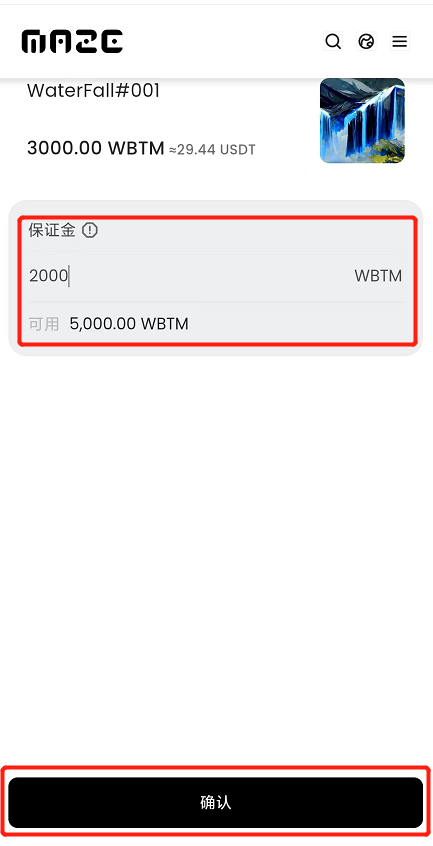

## Maze V2 移动端操作手册

### 一、进入迷宫协议

#### 1.Bycoin版本

用户需将Bycoin更新至3.0.0以上版本，才会显示迷宫协议选项。

#### 2.如何进入迷宫协议

打开Bycoin，在BMC链界面中，点击【Maze V2】，即可进入迷宫协议。

### 二、迷宫协议功能导航

在进入迷宫协议后，可以点击右上角导航栏，跳转至迷宫协议的功能页面，目前Maze协议导航栏可以跳转至【NFT铸造】、【市场】、【排行】、【我的】。

### 三、迷宫协议个人中心

#### 1. 如何进入【我的】

用户可以通过导航栏点击【我的】进入。

#### 2.【我的】信息

进入【我的】后，用户可以在页面中看到自己的【BMC链地址】、【拥有NFT总保证金】【当前拥有】、【被买走的】、【我的铸造】、【我的求购】

#### 3. 编辑修改个人信息

目前迷宫协议内的操作是与用户钱包BMC地址所绑定，所以无法修改地址。点击编辑按钮，可以修改自己显示的名称与自我描述，在填写完成后点击确认，该操作需要确认签名，点击确认签名输入钱包密码，即可在【我的】页面显示更改后的信息。

### 四、如何在迷宫协议查看NFT

#### 1.查看迷宫协议NFT

**在首页查看NFT**

在进入迷宫协议的首页，用户可以向下浏览，通过点击【热门收藏】、【热门成交】、【热门艺术家】、【稀有NFT】的 【查看更多】选项，跳转到市场/排行榜，进行选购。

**在市场选择NFT**

通过导航栏点击【市场】，进入迷宫协议市场，用户可以根据NFT热度及加个进行升降序排序筛选作品，也可以进行NFT作品名称的关键字搜索查询。

### 五、如何在迷宫协议购买NFT

**点击NFT作品**

在选择的NFT作品下方，点击【立即拥有】按钮，进入立即拥有交易页面。最上方显示该NFT目前的作品价格。

**授权合约和WBTM**

首次购买需要授权合约和WBTM，点击授权，签名确认即可

**输入保证金**

根据激进交易模式，用户需要在下方输入持有该NFT作品保证金，在输入完成后，系统将会自动计算所要支付的合计费用、出售价格及预计收益信息。
NFT的出售价格=保证金x10  如：填写保证金为10 WBTM，则该NFT的售价将为10x10=100 WBTM。
预计收益为购买后并且成功售出的收益，预计收益=出售价格x（1-作品版税比例-平台手续费比例）-购买价格。
如：购买价格为100 WBTM，出售价格为120 WBTM，版税为10%，那么预计收益是 120 x（1-10%-1%）-100 = 6.8 WBTM

注意：如果没有WBTM，则需要使用BTM进行兑换

**确认价格**

确认合计费用后点击【确认】按钮，验证钱包密码，完成立即拥有交易。

**查看交易完成拥有的NFT**

完成立即拥有交易后，会在该作品下方留下交易记录，NFT持有者进行变更，持有者可以在【我的】中【当前拥有】进行查看。

