## Maze晶石盲盒和Avatar2合成指南

### 1、抽取晶石盲盒

进入Maze官网 ： https://maz.network/, 点击盲盒活动banner页面，或者直接输入相关域名进入

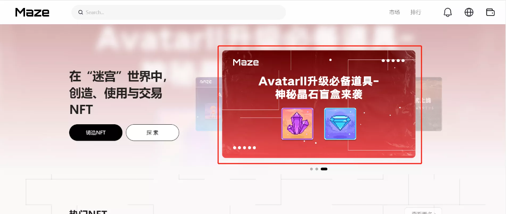

点击进入盲盒页面

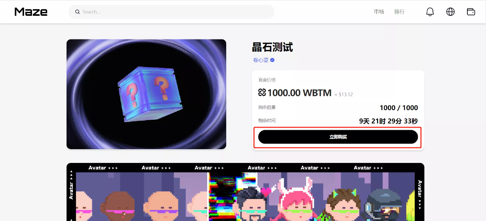

点击购买

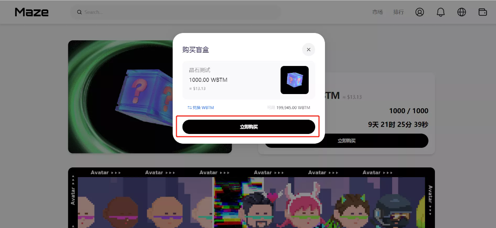

点击立即购买，如果没有WBTM，则进入兑换WBTM页面进行兑换

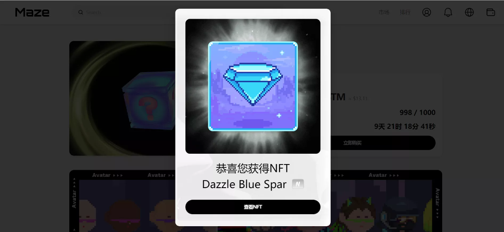

购买成功，活动晶石NFT，点击查看NFT，即可查看获得的NFT 

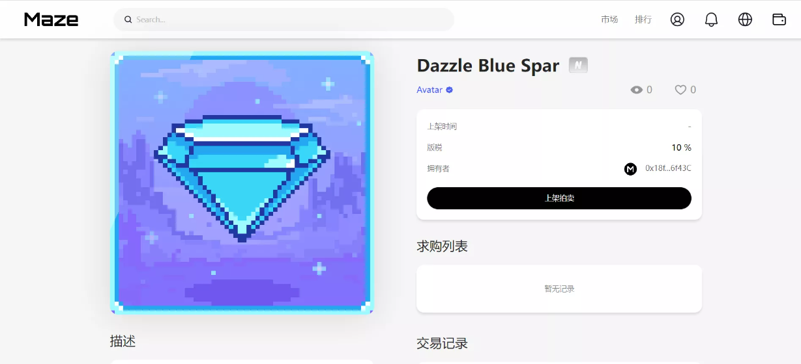

### 2、Avatar2合成

进入合成页面：
https://maz.network/combine/avatar

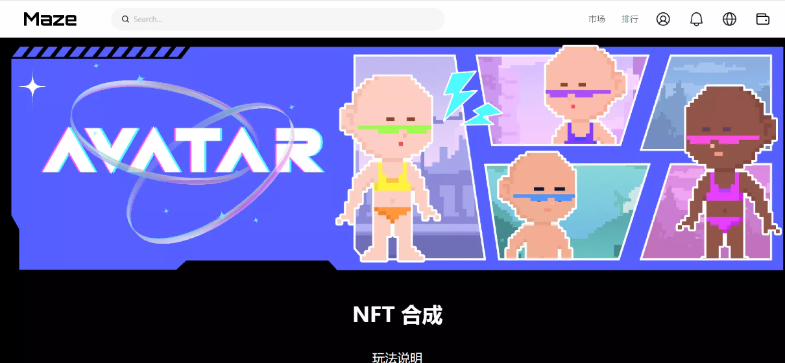

选择需要合成一代Avatar

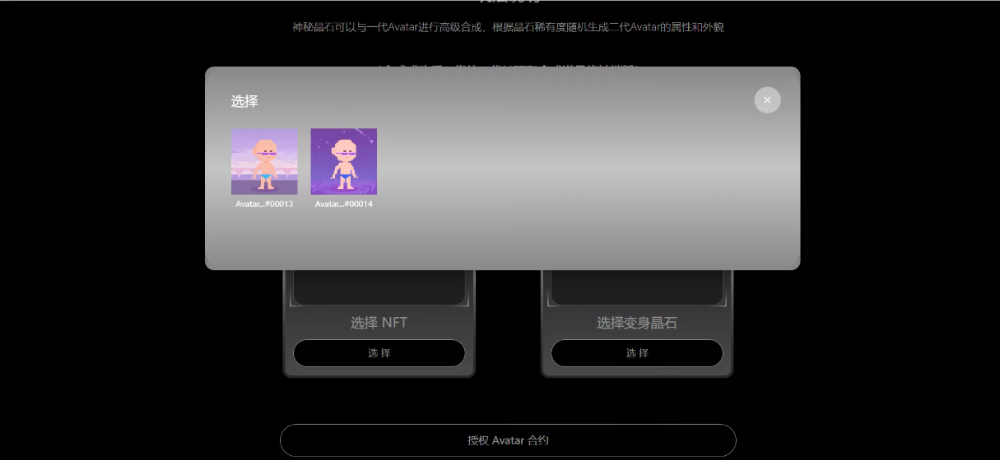

选择需要合成的晶石

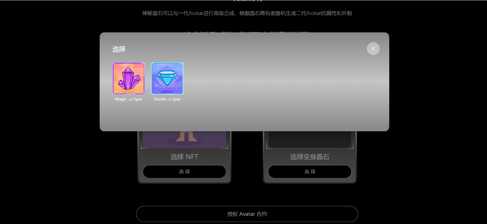

授权Avatar合约，授权Spar合约

点击立即合成

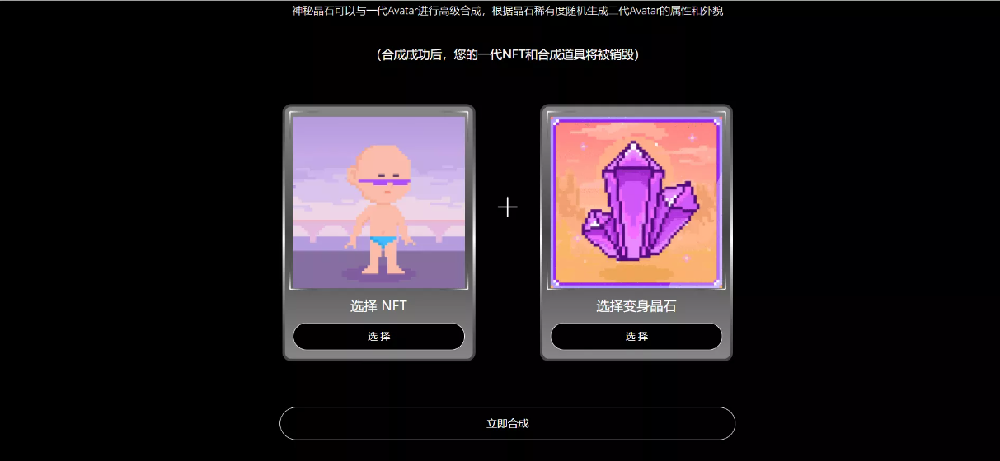

等待合成

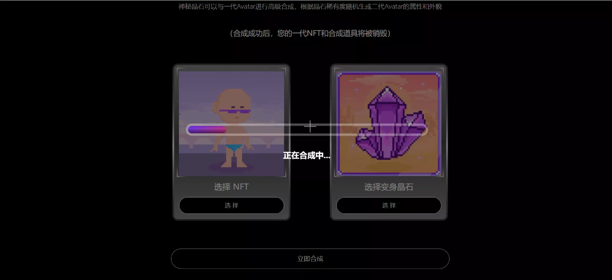

合成成功

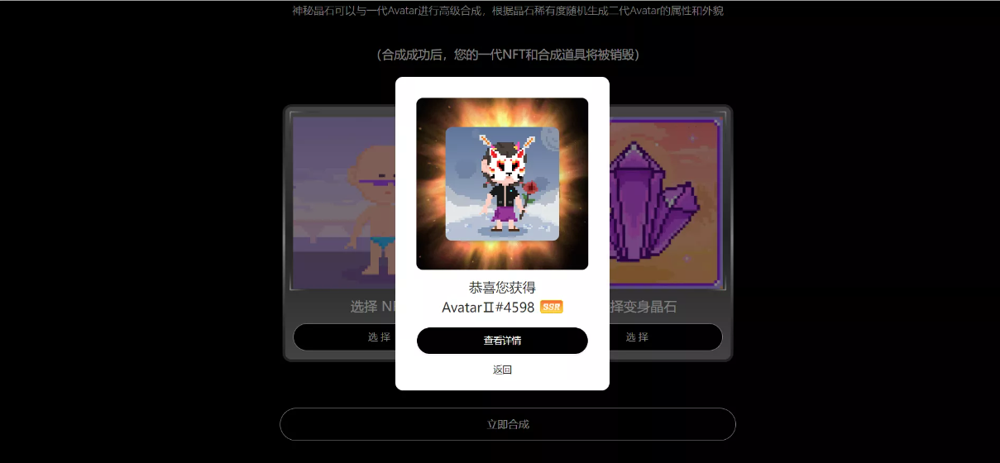

查看NFT详情

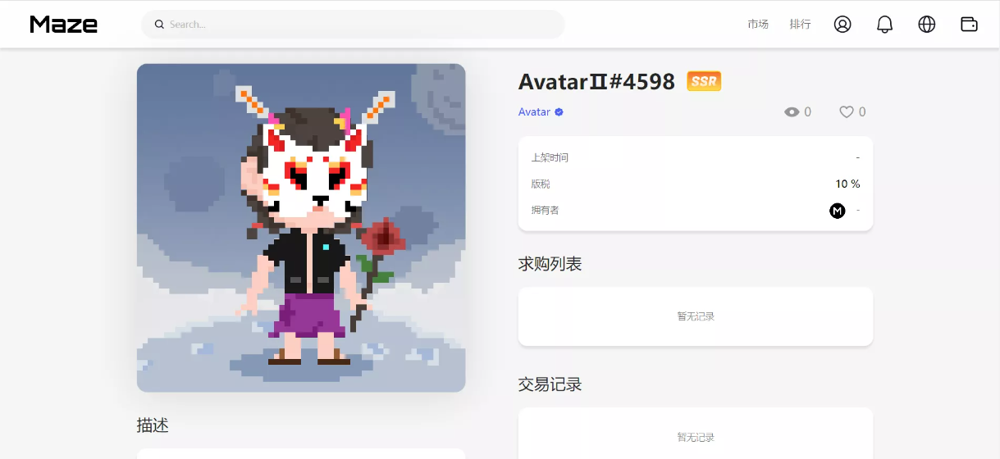
